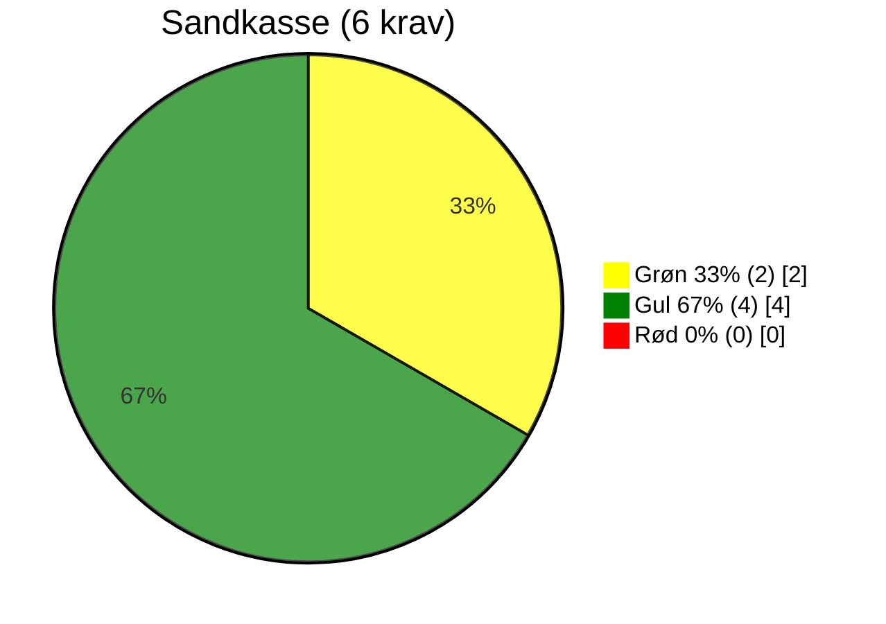
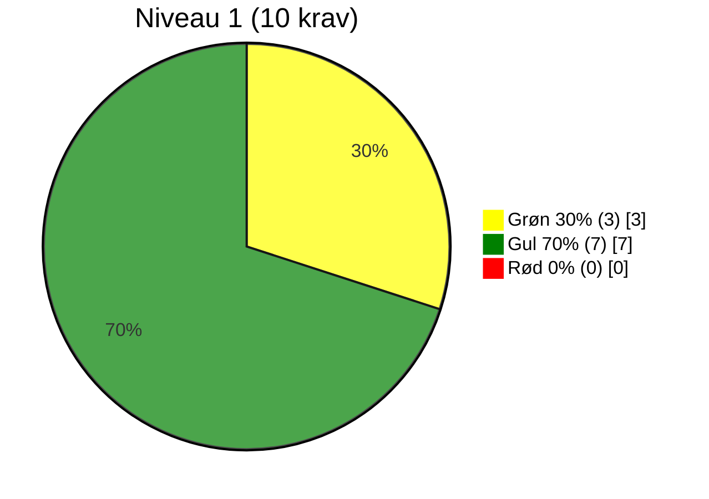
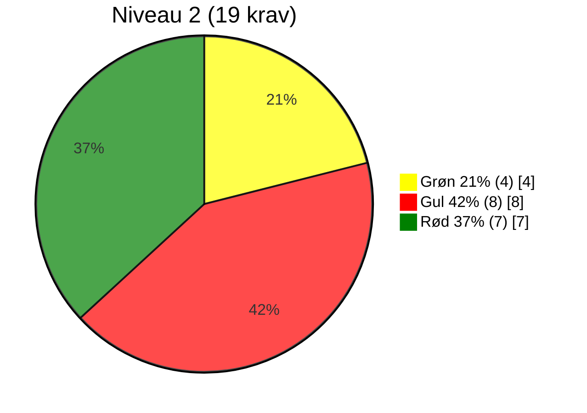
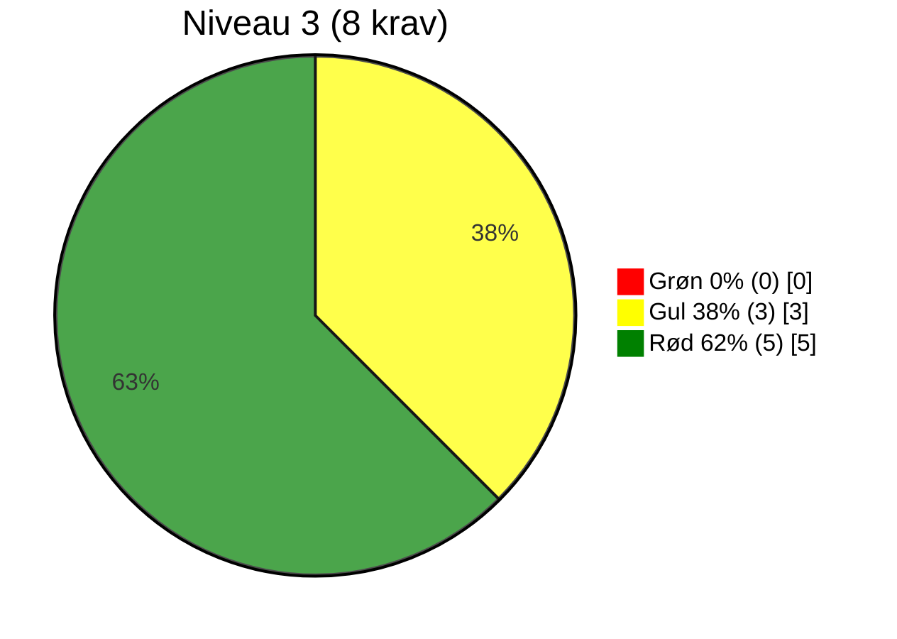
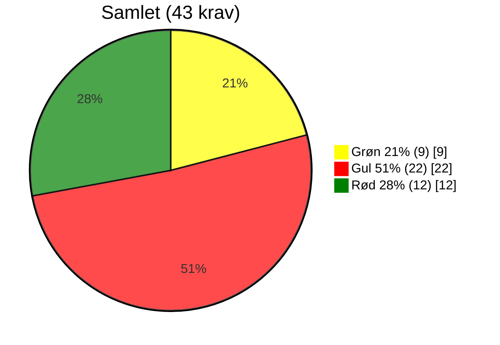

# Evaluering af OS2-produkt: OS2faktor

> **📄 Dokumentinformation**  
> **Evalueringsskabelon version:** 0.9  
> **Dato for udfyldelse:** 16-11-2025  
> **Audit made by:** Rasmus Frey, rasmus@os2.eu    
> **GitHub organisation:** https://github.com/OS2faktor  
> **OS2 website link:** https://www.os2.eu/os2faktor  
> **Governance Report used:** None found

## 📝 Resumé

OS2faktor er et udbredt og strategisk vigtigt sikkerhedsprodukt, der anvendes i mere end 50 kommuner. Løsningen har stærk relevans og høj fællesoffentlig værdi. Revisionen viser dog væsentlige mangler i governance, dokumentation og strategisk understøttelse. Fraværet af en aktiv styregruppe, manglende strategisk og teknisk dokumentation samt ufuldstændig opfyldelse af flere OS2 krav til governance trækker ned i modenheden.

På denne baggrund vurderes OS2faktor til **ikke** at ligge højere end **niveau 1** i OS2’s governancemodel. Det anbefales, at produktet **sænkes til niveau 1**, men at der iværksættes en struktureret professionalisering med det mål at hæve til niveau 2 og senere 3.

## 🔍 Vurdering af alle krav

### 🌍 RELEVANS

| # | Niveau | Krav | Vurderingskriterie | Vurdering | Vurderingsgrundlag |
|---|--------|-------|---------------------|-----------|----------------------|
| R1 | Sandkasse | Løsningen skaber lokal værdi | Standard: Produktet giver konkret og dokumenterbar værdi for den enkelte myndighed. | 🟢 | MFA-sikkerhedsløsning som anvendes i 50+ kommuner. Løsningen understøtter sikker login lokalt og understøttes af central revision hos leverandøren. |
| R2 | 2 | Løsningen er accepteret af lokal linjeledelse | Standard: Linjeledelsen har bakket op om deltagelsen i udviklingen og anvendelsen. | 🟡 | Udbredelsen indikerer bred accept, men der findes ikke dokumenteret ledelsesbeslutning. |
| R3 | 2 | Løsningen har fælles offentligt potentiale | Standard: Kan skabe værdi og genbruges på tværs af myndigheder. | 🟢 | Løsningen anvendes og kan genbruges i kommuner på tværs af landet via én enkelt leverandør. |
| R4 | 3 | Ophæng til nationale strategier er til stede | Standard: Understøtter fx digitaliseringsstrategi og fællesoffentlige mål. | 🟡 | Understøtter informationssikkerhed, men der er ikke dokumenteret eksplicit strategisk ophæng. |

### 🛠️ FORMKRAV

| # | Niveau | Krav | Vurderingskriterie | Vurdering | Vurderingsgrundlag |
|----|--------|-------|---------------------|-----------|----------------------|
| F1 | Sandkasse | Kildekode til projektet udvikles synligt og aktivt i et OS2-repositorie | Standard: Kodebasen er tilgængelig og udvikles åbent på GitHub i OS2-kontrolleret organisation. | 🟡 | Repositorier findes, men udviklingen sker i releases hvor koden uploades samlet, ikke som løbende åben udvikling. |
| F2 | Sandkasse | Open Source-licenskriterier overholdes | Standard: Godkendt Open Source Licens (fx MPL-2.0) er tydeligt angivet og anvendt. | 🟢 | MPL 2.0 er angivet som licens i repositorierne. |
| F3 | Sandkasse | Udbudsregler og almindelig lovformlighed er overholdt | Standard: Projektet følger udbudsregler og gældende lovgivning. | 🟡 | Antages overholdt, men der er ikke offentligt tilgængelig dokumentation (notat/afgørelse) herom. |
| F4 | Sandkasse | Der er tænkt på sikkerheden i løsningen | Standard: Der forefindes dokumenteret sikkerhedsarbejde og/eller procedurer. | 🟡 | Sikkerhed er central i løsningen, men den tilgængelige dokumentation er ældre end 3 år og ikke opdateret til nuværende praksis. Yderligere findes der ikke beskrivelser for proceduren som følges ved fund af sikkerhedshuller og andre sikkerhedsrisici. |
| F5 | Sandkasse | Løsningens formål og værdi er beskrevet | Standard: Formål og værdi er klart beskrevet, gerne i en README tilknyttet kodebasen. | 🟡 | Formål og værdi er beskrevet på os2.eu og i statisk produktmateriale. Der mangler information i projektets repositories, der findes f.eks. ingen README. |
| F6 | 1 | Kildekoden er overdraget og placeret under OS2's GitHub | Standard: Koden er juridisk overdraget og hostes under OS2's GitHub. | 🟡 | Kildekoden for seneste release ligger i en OS2-kontrolleret GitHub-organisation. Det er ukendt om det er den faktiske kildekode som anvendes i drift. |
| F7 | 1 | Dokumentation udarbejdes med og overholder OS2's standardskabelon | Standard: Dokumentation i åbent format (fx Markdown) og OS2’s skabelon anvendt. | 🟡 | Dokumentation foreligger, men ikke systematisk i henhold til OS2's dokumentationsskabelon/struktur. Dokumentation ligger i lukkede formater og det er ukendt om dokumentationen vedligeholdes og er tilstrækkelig. |
| F10 | 1 | OS2's kommunikationskanaler anvendes | Standard: Information findes på os2.eu. | 🟢 | Produktside på os2.eu samt referater og økonomi-materiale er tilgængeligt. |
| F11 | 1 | Offentlig issue-tracking anvendes | Standard: Opgaver (issues) og kodeændringer spores offentligt og tilknyttes GitHub. | 🟡 | En Jira issue-tracker anvendes, men er ikke umiddelbart offentlig tilgængelig og issues er ikke tydeligt koblet til relevante commits/releases. |
| F12 | 2 | Kun én version af core-koden (master) | Standard: Ingen parallelle versioner af kodebasen. | 🟡 | Én aktiv hovedversion (main/master), ingen konkurrerende forks i OS2-regi. Det findes dog ikke dokumentation for om der findes forks i regi af leverandøren. Behovet for dokumentationen opstår da den tilgængelige kildekode blot er upload af seneste release. Derfor antages det, at der udvikles et andet sted og driftsversion ikke nødvendigvis er den samme version som OS2 holder.  |
| F13 | 2 | Præsentationsmateriale af løsningen er udarbejdet | Standard: Der findes præsentationer om produktet. | 🟡 | Der kan lokalisers slides/introduktionsmateriale af ældre dato, men intet samlet og tydeligt tilgængeligt materiale. |
| F14 | 2 | Kommunikationsmateriale til strategisk niveau | Standard: Der findes materialer målrettet ledelse og strategi. | 🔴 | Ingen identificerede one-pagers, business cases eller ledelses-præsentationer. |
| F15 | 2 | Best practice for implementering i organisationen dokumenteres | Standard: Vejledninger og erfaringer er beskrevet. | 🟡 | Der findes implementeringsvejledning i fragmenteret form. Det er af ældre dato og følger ikke OSS best practice. |
| F16 | 2 | Teknisk dokumentation indeholder best practice for kodestandarder | Standard: Kodestandarder dokumenteret, relevant dokumentation til udviklere. | 🟡 | Teknisk dokumentation findes delvist, men kodestandarder og arkitekturprincipper mangler eksplicit beskrivelse. Dokumentationen er endivere af ældre dato og ikke tilgængelig i et åbent format som efterlever best practice. |
| F17 | 2 | Drifts- og vedligeholdelsessetup er beskrevet | Standard: Driftmiljø og procedurer for vedligehold beskrevet. | 🟡 | Drift- og vedligeholdelsesmodel er beskrevet stykvist, men ikke i et samlet, åbent og opdateret dokument som efterlever best practice. Dokumentationen er endivere af ældre dato. |
| F18 | 2 | Rammearkitektur og standarder er fulgt og afvigelser forklaret | Standard: Overensstemmelse med rammearkitektur er beskrevet. | 🔴 | Ingen dokumenteret kobling til fællesoffentlig rammearkitektur eller beskrivelse af eventuelle afvigelser. |
| F19 | 2 | Løsningen leveret i containerformat | Standard: Fx Docker anvendes. | 🟢 | Løsningen leveres umiddelbart som Docker-container og kan driftes containeriseret. |
| F20 | 2 | Uddannelsesmateriale er udarbejdet | Standard: Undervisningsmaterialer findes. | 🔴 | Der er ikke identificeret dedikeret trænings- og undervisningsmateriale til brugere eller administratorer. |
| F21 | 3 | Politisk kommunikation er udarbejdet | Standard: Materialer målrettet politikere og offentlighed er udarbejdet. | 🔴 | Ingen materialer målrettet politiske beslutningstagere (udvalg, byråd mv.). |
| F22 | 3 | Procesplan og procesansvar for drift er udarbejdet | Standard: Dokumenteret proces og ansvar ifm. idriftsættelse. | 🟡 | Visse processer kan aflæses og stykkes sammen af referater og dokumentation, men der findes ikke en samlet formel procesplan. |

### 🏛️ STRATEGISK SAMMENHÆNG

| # | Niveau | Krav | Vurderingskriterie | Vurdering | Vurderingsgrundlag |
|---|--------|-------|---------------------|-----------|----------------------|
| S1 | 1 | Produktet har kobling til OS2's strategi | Standard: Understøtter OS2’s mission og vision. | 🟡 | Understøtter fællesoffentlig digitalisering, genbrug og en open source-baseret tilgang. Der findes dog ingen dokumentation herfor samt det er ikke tydeligt om projektet aktivt understøtter frit leverandørvalg og mulighed for konkurrenceudsættelse. |
| S2 | 1 | Løsningen understøtter innovation og open source | Standard: Fremmer innovation og åbenhed. | 🟡 | Er en Open source-løsning, der muliggør fælles udvikling. Der er ikke fundet dokumentation for deltagelse og der er ikke dokumenteret fuld åbenhed i projektet. Derfor konkluderes det at løsningen ikke til fulde understøtter en åben samarbejdsform. |
| S3 | 2 | Kobling til OS2's mission, vision og strategi er beskrevet | Standard: Forbindelsen er beskrevet. | 🟡 | Sammenhængen er reel for de få med kendskab, men ikke beskrevet i et formelt og offentligt tilgængeligt strategidokument for OS2faktor. |
| S4 | 2 | Vision og strategi for produktet er udarbejdet | Standard: Der findes en formel vision og strategi for produktet. | 🔴 | Der er ikke identificeret et særskilt dokument med vision, mål og strategi for OS2faktor. |
| S5 | 3 | Produktets overensstemmelse med OS2's vision og strategi | Standard: Tydelig sammenhæng og beskrivelse. | 🔴 | Ingen samlet strategibeskrivelse, der dokumenterer fuld sammenhæng med OS2’s overordnede retning. |

### 👥 GOVERNANCE

| # | Niveau | Krav | Vurderingskriterie | Vurdering | Vurderingsgrundlag |
|----|--------|-------|---------------------|-----------|----------------------|
| G1 | 1 | Produktet er oprettet i OS2's porteføljestyring | Standard: Findes i OS2’s porteføljedatabase, hjemmeside og årshjul. | 🟢 | OS2faktor er opført som produkt på os2.eu og indgår i OS2-porteføljen. |
| G2 | 1 | Der koordineres løbende med OS2-sekretariatet | Standard: Der er løbende kontakt med sekretariatet. | 🟡 | Der er dialog, men ikke formaliseret i en fast mødestruktur eller årshjul. Der er heller ikke en dokumenteret procedure for udarbejdelse og opdatering af governance rapporten. |
| G3 | 1 | Projektleder/tovholder er udpeget | Standard: Der er udpeget en fast kontaktperson/koordinator. | 🟡 | Funktionelt findes en tovholder i kraft af leverandøren, men rolle, ansvar og mandat er ikke dokumenteret. |
| G4 | 1 | Bestyrelsen er orienteret | Standard: Bestyrelsen kender til projektet. | 🟢 | Bestyrelsen er orienteret via porteføljestyring og løbende rapportering. |
| G5 | 2 | Bestyrelsen har godkendt produktet | Standard: Formelt godkendt i referater. | 🟡 | Produktet må anses for godkendt gennem praksis, men formel beslutning kan ikke entydigt dokumenteres da der mangler en governance rapport. |
| G6 | 2 | Der er nedsat en styregruppe | Standard: Der findes en aktiv styregruppe. | 🔴 | Der findes pt. ikke en aktiv og dokumenteret styregruppe for OS2faktor. |
| G7 | 2 | Der er nedsat en koordinationsgruppe | Standard: Der findes en aktiv koordinationsgruppe. | 🟢 | Der eksisterer en koordination som leverandøren er tovholder for. Der er jævnligt møder som udelukkende anvendes til at drøfte udvikling. |
| G8 | 2 | Projektmodel anvendes og dokumenteret (anbefaling) | Standard: Der arbejdes efter en dokumenteret projektmodel. | 🔴 | Der er ikke dokumenteret anvendelse af en projektmodel for videreudvikling af produktet. |
| G9 | 2 | Review af kode foretages af tredjepart (anbefaling) | Standard: Uafhængig kodegennemgang gennemføres og procedure er beskrevet. | 🔴 | Der er ikke dokumenteret opdaterede tredjeparts kodereviews eller fast procedure for dette. Dog findes et review som er knap 4 år gammelt. |
| G10 | 2 | Tilslutningserklæring til sikring af økonomi (anbefaling) | Standard: OS2-tilslutningsaftale findes og er effektueret. | 🟢 | Tilslutningsaftale findes og understøtter videreudvikling økonomisk. |
| G11 | 3 | Bestyrelsen har godkendt styregruppen | Standard: Bestyrelsen har formelt godkendt sammensætning af styregruppen. | 🔴 | Der er ingen styregruppe, og dermed ingen godkendelse. |
| G12 | 3 | Bestyrelsen er repræsenteret i styregruppen | Standard: Bestyrelsesmedlem deltager. | 🔴 | Ingen dokumenteret styregruppe med bestyrelsesrepræsentation. |
| G13 | 3 | Aftale sikrer økonomi til koordinering og videreudvikling | Standard: Aftaler om finansiering er på plads og budget udarbejdet. | 🟡 | Finansieringen er delvist på plads gennem tilslutning, men den er minimal og dækker udelukkende videreudviklingsopgaver. Der er ikke tydeligt prioriteret og budgetteret. |
| G14 | 3 | Fagligt fællesskab bag løsningen | Standard: Aktivt fællesskab, fx brugerklub, forum eller andet netværk. | 🔴 | Ingen formaliseret brugerklub eller fagligt netværk omkring OS2faktor. |

### Antal krav fordelt på tema
* Relevans: *4 krav* (R1–R4)
* Formkrav: *20 krav* (F1–F22, minus F8 og F9 som er sammenlagt med F7)
* Strategisk sammenhæng: *5 krav* (S1–S5)
* Governance: *14 krav* (G1–G14)
* *I alt: 43 krav*

### Antal krav fordelt på niveau

Bemærk at der nedarves så et niveau 2 produkt skal også efterleve sandkasse og niveau 2.

* Sandkasse: *6 krav*
* Niveau 1: *10 krav* (16 i alt)
* Niveau 2: *19 krav* (35 i alt)
* Niveau 3: *8 krav* (43 i alt)
* *I alt: 43 krav*

## 🏷️ Hvad betyder trafiklysene?

- 🟢 **Grøn** → Kravet er fuldt opfyldt og fungerer som forventet.
- 🟡 **Gul** → Kravet er delvist opfyldt, men der er mangler, som bør adresseres.
- 🔴 **Rød** → Kravet er ikke opfyldt, og der er behov for handling.

## 📊 Optælling af vurderinger pr. niveau og tema

| Niveau      | 🟢 Grøn | 🟡 Gul | 🔴 Rød | I alt |
|-------------|--------:|-------:|------:|------:|
| Sandkasse   |       2 |      4 |     0 |     6 |
| Niveau 1    |       3 |      7 |     0 |    10 |
| Niveau 2    |       3 |     10 |     7 |    20 |
| Niveau 3    |       0 |      2 |     5 |     7 |
| **Samlet**  |       8 |     23 |    12 |    43 |

| Tema / Niveau | Sandkasse (6 krav) | Niveau 1 (6+10 krav) | Niveau 2 (19 + 16 krav) | Niveau 3 >(8 + 35 krav) | Total |
|----------------------|--------------------------|-------------------------|--------------------------|--------------------------|--------|
| **Relevans**             | 🟢 1                    |                         | 🟢 1 🟡 1               | 🟡 1                    | 🟢 2 🟡 2 |
| **Formkrav**             | 🟢 1 🟡 4               | 🟢 1 🟡 3               | 🟢 1 🟡 5 🔴 3          | 🟡 1 🔴 1               | 🟢 3 🟡 13 🔴 4 |
| **Strategisk sammenhæng**|                         | 🟡 2                    | 🟡 1 🔴 1               | 🔴 1                    | 🟡 3 🔴 2 |
| **Governance**           |                         | 🟢 2 🟡 2               | 🟢 2 🟡 1 🔴 3          | 🟡 1 🔴 3               | 🟢 4 🟡 4 🔴 6 |
| **Samlet** | 🟢 2 (33%) 🟡 4 (67%) | 🟢 3 (30%) 🟡 7 (70%) | 🟢 4 (21%) 🟡 8 (42%) 🔴 7 (37%) | 🟡 3 (38%) 🔴 5 (62%) | 🟢 9 (21%) 🟡 22 (51%) 🔴 12 (28%) |

<!--
Nedenfor er mermaid kode til at vise procentfordeling i lagkagediagrammer.
Bemærk at mermaid renderer efter størrelse på værdi. Så er Grøn størst vil det være pie1, men er rød størst vil det være pie1. Derfor skal du ændre på themeVariables så farvekoder bliver korrekte.

Color codes used:
Green: 008000
Yellow: FFFF00
Red: FF0000

-->

## 📋 Hvordan bruges optællingen?

- **Sandkasse:** Grundlæggende formalia – mange 🔴 her betyder, at produktet skal løftes bare for at blive betragtet som OS2-kompatibelt.  
- **Niveau 1:** Basis governance og dokumentation – – mange 🟡 eller 🔴 her peger på udfordringer med at skabe overblik og ejerskab.   
- **Niveau 2:** Drift, vedligehold og strategisk understøttelse – mange 🟡 eller 🔴 her peger på modenhedsproblemer.  
- **Niveau 3:** Avanceret governance og fællesskab – et område, hvor ikke alle produkter nødvendigvis når i mål, men som er ønskværdigt for stabile og bæredygtige produkter.

Ud fra optællingen kan vi vurdere, hvor produktet står samlet set:

- Mange 🟢 → Produktet er solidt forankret i governance-kravene.
- Mange 🟡 → Produktet har et godt grundlag, men kræver en prioriteret indsats på udvalgte områder.
- Mange 🔴 → Produktet har alvorlige governance-mangler og kræver en struktureret genopretning.

## 🔍 Overordnet vurdering

OS2faktor er et bredt anvendt og forretningskritisk produkt for rigtig mange kommuner. Relevans og fællesoffentligt potentiale har en stærk tilstedeværelse og produktet har en klar kobling til OS2’s formål og vision.

Governance-mæssigt er der dog væsentlige huller:

- Ingen aktiv og dokumenteret styregruppe.  
- Koordinationsgruppe og fællesskab om udvikling er kun svagt formaliseret. 
- Brugerklub og åben videndeling er fraværende.   
- Strategisk dokumentation (vision, roadmap, strategi) mangler.  
- Teknisk dokumentation, sikkerhedsbeskrivelse og drift-/vedligeholdelsessetup er fragmenteret.  
- Nøglekrav på niveau 2 og 3 (styregruppe, rammearkitektur, uddannelsesmateriale, politisk kommunikation, finansiering) er enten delvist eller ikke opfyldt.

Samlet vurderes OS2faktor til **niveau 1** i OS2’s governancemodel. Produktet er stabilt nok til at være i porteføljen og anvendes bredt, men governance og dokumentation er ikke stærke nok til at retfærdiggøre niveau 2.

## 📈 Anbefaling

det anbefales at **sænke OS2faktor til niveau 1** formelt, og gennemfør et struktureret governance-løft med målet om at bringe produktet til **niveau 2** inden for en aftalt tidshorisont.

### Høj prioritet (kritiske governance- og sikkerhedselementer)

- **Etabler en aktiv styregruppe**
  - Udpeg formand, medlemmer og mandat.
  - Fastlæg mødefrekvens og standarddagsordener.
  - Sikr tæt kobling til OS2’s bestyrelse og sekretariat.

- **Udarbejd et strategisk dokument for OS2faktor**
  - Vision, målgruppe, anvendelsesområde og sammenhæng til OS2’s strategi.
  - Roadmap for funktionel og teknisk udvikling (1–3 år).
  - Governance-model (roller, beslutningsgange, ansvar).

- **Saml teknisk og sikkerhedsmæssig dokumentation** i et konsistent sæt dokumenter
  - Arkitekturdiagrammer og komponentbeskrivelser.
  - Sikkerhedsmodel (trusselsbillede, kontroller, logning, adgangsstyring).
  - Kodestandarder, releaseproces, test- og QA-praksis.
  - Beskrivelse af driftmiljø (on-prem/cloud/container) og afhængigheder.

- **Etabler fælles praksis for offentlig issue-tracking og releases**
  - Konsekvent brug af GitHub issues og commits.
  - Klare labels for fejl, forbedringer og sikkerhedsrelaterede issues.
  - Release-notes, der kobler issues til konkrete versioner.

### Mellem prioritet (modenhed, rammearkitektur og implementering)

- **Udarbejd implementeringsvejledninger og best practice**
  - Standardiseret “kom i gang”-pakke til nye kommuner.
  - Eksempler på konfiguration, integrationer og organisatorisk implementering.

- **Udarbejd risikoanalyse og exitstrategi**
  - Vurdering af leverandørafhængighed, sikkerhedsrisici og driftsrisici.
  - Plan for håndtering ved leverandørskifte eller ophør af drift.

- **Dokumentér overensstemmelse med rammearkitektur**
  - Beskriv hvordan OS2faktor forholder sig til fællesoffentlig rammearkitektur og standarder.
  - Forklar eventuelle afvigelser og begrundelser.

- **Formalisér finansieringsmodel for koordinering, vedligehold og videreudvikling**
  - Langsigtet økonomisk model (koordinering, vedligehold, udvikling).
  - Budget og prioriteringsprincipper for udviklingsønsker.

### Lav prioritet (fællesskab og politisk forankring)

- **Etabler en brugerklub eller fagligt fællesskab**
  - Regelmæssige erfa-møder, online fællesskab eller faglige netværk.
  - Kanal til at samle ønsker, behov og erfaringer fra kommunerne.

- **Udarbejd strategisk og politisk kommunikation**
  - One-pager til direktions-/chefniveau.
  - Materiale til politiske udvalg/byråd (formål, gevinster, risici).
  - Case-historier fra kommuner, der har implementeret OS2faktor.
 
OS2faktor har en stærk forretningsmæssig og fællesoffentlig relevans, men mangler dokumenteret governance og strategisk/teknisk understøttelse.  
Med et fokuseret governance-løft kan produktet bringes på niveau 2, hvilket vil styrke både robusthed, tillid og udbredelse i OS2-fællesskabet.
