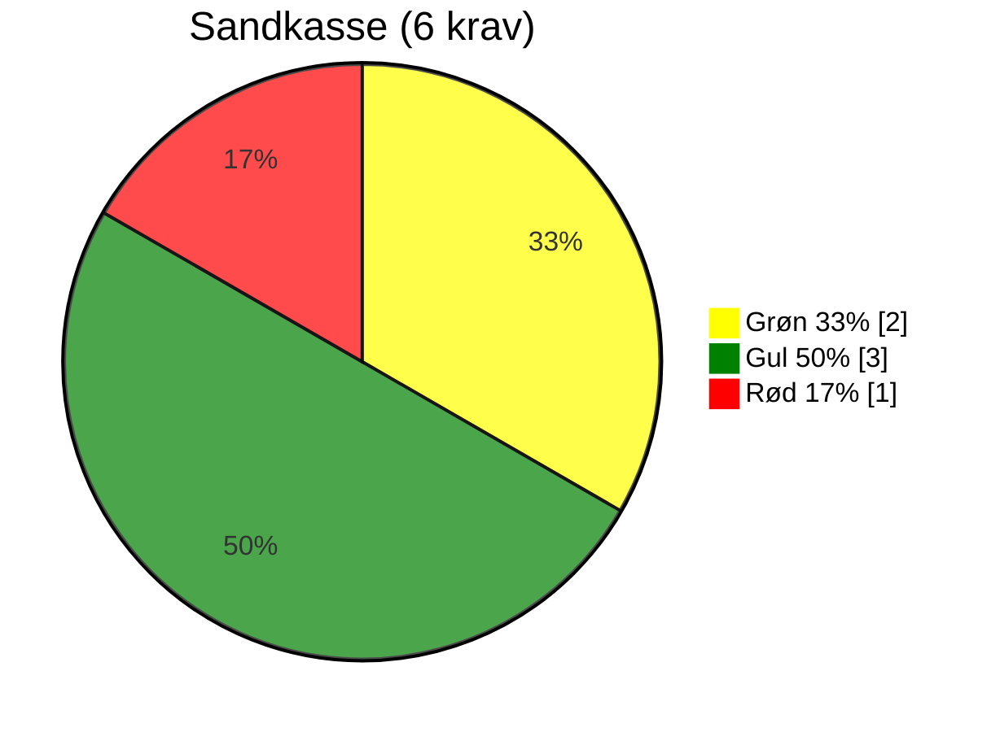
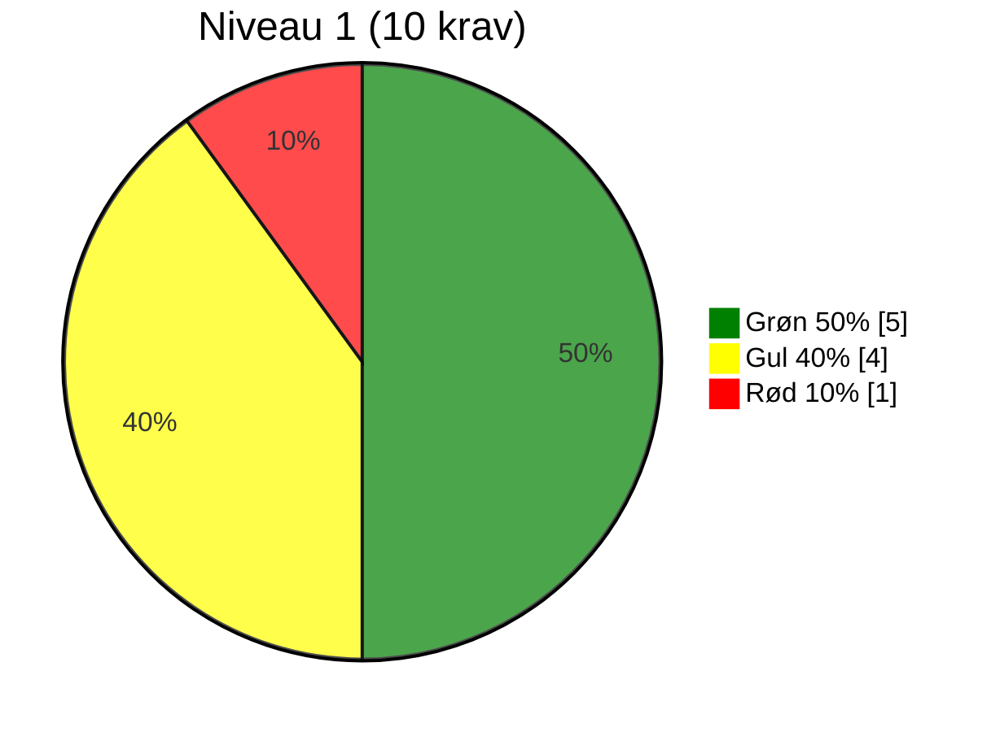
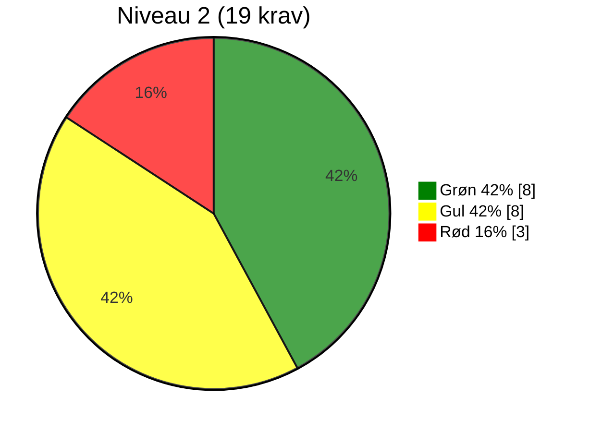
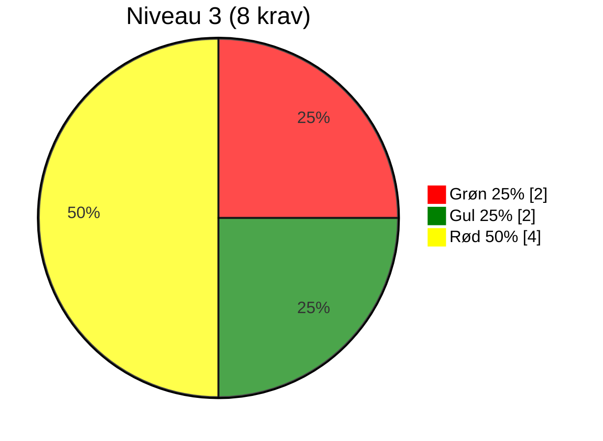
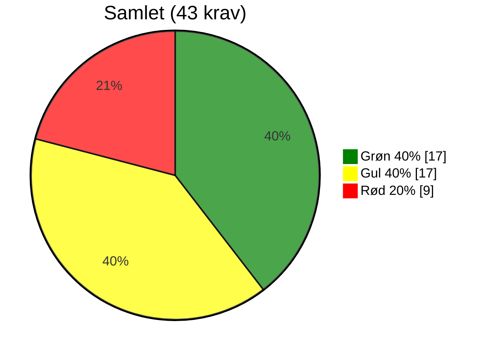

# Evaluering af OS2-produkt: [Produktnavn]

> **📄 Dokumentinformation**  
> **Evalueringsskabelon version:** 0.9.1  
> **Dato for udfyldelse:** [dd-mm-yyyy]  
> **Evaluering lavet af:** [Navn]  
> **GitHub organisation:** [indsæt link til github organisation/repo]  

## 📝 Resumé
[Her skrives et meget kort resumé af den samlede vurdering og anbefaling.]

## 🔍 Overordnet vurdering
[Her skrives en samlet vurdering: hvilke styrker, hvilke forbedringspunkter, anbefalinger til næste skridt.]

## 📈 Anbefaling
[Her skrives et overblik over anbefalinger - gerne i punktform]

---

## 🌍 RELEVANS

| #   | Niveau    | Krav                                             | Vurderingskriterie                                                                  | Vurdering     | Vurderingsgrundlag    |
|-----|-----------|--------------------------------------------------|-------------------------------------------------------------------------------------|---------------|-----------------------|
| R1  | Sandkasse | Løsningen skaber lokal værdi                     | Standard: Produktet giver konkret og dokumenterbar værdi for den enkelte myndighed. | 🟢 / 🟡 / 🔴 |                       |
| R2  | 2         | Løsningen er accepteret af lokal linjeledelse    | Standard: Linjeledelsen har bakket op om deltagelsen i udviklingen og anvendelsen.  | 🟢 / 🟡 / 🔴 |                       |
| R3  | 2         | Løsningen har fælles offentligt potentiale       | Standard: Kan skabe værdi og genbruges på tværs af myndigheder.                     | 🟢 / 🟡 / 🔴 |                       |
| R4  | 3         | Ophæng til nationale strategier er til stede     | Standard: Understøtter fx digitaliseringsstrategi og fællesoffentlige mål.          | 🟢 / 🟡 / 🔴 |                       |

## 🛠️ FORMKRAV

| #    | Niveau    | Krav                                                                         | Vurderingskriterie                                                                               | Vurdering     | Vurderingsgrundlag    |
|------|-----------|------------------------------------------------------------------------------|--------------------------------------------------------------------------------------------------|---------------|-----------------------|
| F1   | Sandkasse | Kildekode til projektet udvikles synligt og aktivt i et OS2-repositorie      | Standard: Kodebasen er tilgængelig og udvikles åbent på GitHub i OS2-kontrolleret organisation.  | 🟢 / 🟡 / 🔴 |                       |
| F2   | Sandkasse | Open Source-licenskriterier overholdes                                       | Standard: Godkendt Open Source Licens (fx MPL-2.0) er tydeligt angivet og anvendt.               | 🟢 / 🟡 / 🔴 |                       |
| F3   | Sandkasse | Udbudsregler og almindelig lovformlighed er overholdt                        | Standard: Projektet følger udbudsregler og gældende lovgivning.                                  | 🟢 / 🟡 / 🔴 |                       |
| F4   | Sandkasse | Der er tænkt på sikkerheden i løsningen                                      | Standard: Der forefindes dokumenteret sikkerhedsarbejde og/eller procedurer.                     | 🟢 / 🟡 / 🔴 |                       |
| F5   | Sandkasse | Løsningens formål og værdi er beskrevet                                      | Standard: Formål og værdi er klart beskrevet, gerne i en README tilknyttet kodebasen.            | 🟢 / 🟡 / 🔴 |                       |
| F6   | 1         | Kildekoden er overdraget og placeret under OS2's GitHub                      | Standard: Koden er juridisk overdraget og hostes under OS2's GitHub.                             | 🟢 / 🟡 / 🔴 |                       |
| F7   | 1         | Dokumentation udarbejdes med og overholder OS2's standardskabelon            | Standard: Dokumentation i åbent format (fx Markdown) og OS2’s skabelon anvendt.                  | 🟢 / 🟡 / 🔴 |                       |
| F10  | 1         | OS2's kommunikationskanaler anvendes                                         | Standard: Information findes på os2.eu.                                                          | 🟢 / 🟡 / 🔴 |                       |
| F11  | 1         | Offentlig issue-tracking anvendes                                            | Standard: Opgaver (issues) og kodeændringer spores offentligt og tilknyttes GitHub.              | 🟢 / 🟡 / 🔴 |                       |
| F12  | 2         | Kun én version af core-koden (master)                                        | Standard: Ingen parallelle versioner af kodebasen.                                               | 🟢 / 🟡 / 🔴 |                       |
| F13  | 2         | Præsentationsmateriale af løsningen er udarbejdet                            | Standard: Der findes præsentationer om produktet.                                                | 🟢 / 🟡 / 🔴 |                       |
| F14  | 2         | Kommunikationsmateriale til strategisk niveau                                | Standard: Der findes materialer målrettet ledelse og strategi.                                   | 🟢 / 🟡 / 🔴 |                       |
| F15  | 2         | Best practice for implementering i organisationen dokumenteres               | Standard: Vejledninger og erfaringer er beskrevet.                                               | 🟢 / 🟡 / 🔴 |                       |
| F16  | 2         | Teknisk dokumentation indeholder best practice for kodestandarder            | Standard: Kodestandarder dokumenteret, relevant dokumentation til udviklere.                     | 🟢 / 🟡 / 🔴 |                       |
| F17  | 2         | Drifts- og vedligeholdelsessetup er beskrevet                                | Standard: Driftmiljø og procedurer for vedligehold beskrevet.                                    | 🟢 / 🟡 / 🔴 |                       |
| F18  | 2         | Rammearkitektur og standarder er fulgt og afvigelser forklaret               | Standard: Overensstemmelse med rammearkitektur er beskrevet.                                     | 🟢 / 🟡 / 🔴 |                       |
| F19  | 2         | Løsningen leveret i containerformat                                          | Standard: Fx Docker anvendes.                                                                    | 🟢 / 🟡 / 🔴 |                       |
| F20  | 2         | Uddannelsesmateriale er udarbejdet                                           | Standard: Undervisningsmaterialer findes.                                                        | 🟢 / 🟡 / 🔴 |                       |
| F21  | 3         | Politisk kommunikation er udarbejdet                                         | Standard: Materialer målrettet politikere og offentlighed er udarbejdet.                         | 🟢 / 🟡 / 🔴 |                       |
| F22  | 3         | Procesplan og procesansvar for drift er udarbejdet                           | Standard: Dokumenteret proces og ansvar ifm. idriftsættelse.                                     | 🟢 / 🟡 / 🔴 |                       |

## 🏛️ STRATEGISK SAMMENHÆNG

| #   | Niveau    | Krav                                                       | Vurderingskriterie                                                    | Vurdering     | Vurderingsgrundlag    |
|-----|-----------|------------------------------------------------------------|-----------------------------------------------------------------------|---------------|-----------------------|
| S1  | 1         | Produktet har kobling til OS2's strategi                   | Standard: Understøtter OS2’s mission og vision.                       | 🟢 / 🟡 / 🔴 |                       |
| S2  | 1         | Løsningen understøtter innovation og open source           | Standard: Fremmer innovation og åbenhed.                              | 🟢 / 🟡 / 🔴 |                       |
| S3  | 2         | Kobling til OS2's mission, vision og strategi er beskrevet | Standard: Forbindelsen er beskrevet.                                  | 🟢 / 🟡 / 🔴 |                       |
| S4  | 2         | Vision og strategi for produktet er udarbejdet             | Standard: Der findes en formel vision og strategi for produktet.      | 🟢 / 🟡 / 🔴 |                       |
| S5  | 3         | Produktets overensstemmelse med OS2's vision og strategi   | Standard: Tydelig sammenhæng og beskrivelse.                          | 🟢 / 🟡 / 🔴 |                       |

## 👥 GOVERNANCE

| #    | Niveau    | Krav                                                       | Vurderingskriterie                                                            | Vurdering     | Vurderingsgrundlag    |
|------|-----------|------------------------------------------------------------|-------------------------------------------------------------------------------|---------------|-----------------------|
| G1   | 1         | Produktet er oprettet i OS2's porteføljestyring            | Standard: Findes i OS2’s porteføljedatabase, hjemmeside og årshjul.           | 🟢 / 🟡 / 🔴 |                       |
| G2   | 1         | Der koordineres løbende med OS2-sekretariatet              | Standard: Der er løbende kontakt med sekretariatet.                           | 🟢 / 🟡 / 🔴 |                       |
| G3   | 1         | Projektleder/tovholder er udpeget                          | Standard: Der er udpeget en fast kontaktperson/koordinator.                   | 🟢 / 🟡 / 🔴 |                       |
| G4   | 1         | Bestyrelsen er orienteret                                  | Standard: Bestyrelsen kender til projektet.                                   | 🟢 / 🟡 / 🔴 |                       |
| G5   | 2         | Bestyrelsen har godkendt produktet                         | Standard: Formelt godkendt i referater.                                       | 🟢 / 🟡 / 🔴 |                       |
| G6   | 2         | Der er nedsat en styregruppe                               | Standard: Der findes en aktiv styregruppe.                                    | 🟢 / 🟡 / 🔴 |                       |
| G7   | 2         | Der er nedsat en koordinationsgruppe                       | Standard: Der findes en aktiv koordinationsgruppe.                            | 🟢 / 🟡 / 🔴 |                       |
| G8   | 2         | Projektmodel anvendes og dokumenteret (anbefaling)         | Standard: Der arbejdes efter en dokumenteret projektmodel.                    | 🟢 / 🟡 / 🔴 |                       |
| G9   | 2         | Review af kode foretages af tredjepart (anbefaling)        | Standard: Uafhængig kodegennemgang gennemføres og procedure er beskrevet.     | 🟢 / 🟡 / 🔴 |                       |
| G10  | 2         | Tilslutningserklæring til sikring af økonomi (anbefaling)  | Standard: OS2-tilslutningsaftale findes og er effektueret.                    | 🟢 / 🟡 / 🔴 |                       |
| G11  | 3         | Bestyrelsen har godkendt styregruppen                      | Standard: Formelt godkendt i referater.                                       | 🟢 / 🟡 / 🔴 |                       |
| G12  | 3         | Bestyrelsen er repræsenteret i styregruppen                | Standard: Bestyrelsesmedlem deltager.                                         | 🟢 / 🟡 / 🔴 |                       |
| G13  | 3         | Aftale sikrer økonomi til koordinering og videreudvikling  | Standard: Aftaler om finansiering er på plads og budget udarbejdet.           | 🟢 / 🟡 / 🔴 |                       |
| G14  | 3         | Fagligt fællesskab bag løsningen                           | Standard: Aktivt fællesskab, fx brugerklub, forum eller andet netværk.        | 🟢 / 🟡 / 🔴 |                       |

---

## 📊 Optælling af vurderinger pr. niveau og tema

| Niveau      | 🟢 Grøn              | 🟡 Gul               | 🔴 Rød               |
|-------------|----------------------|----------------------|-----------------------|
| Sandkasse   | [antal 🟢 Sandkasse] | [antal 🟡 Sandkasse] | [antal 🔴 Sandkasse] |
| Niveau 1    | [antal 🟢 Niveau 1]  | [antal 🟡 Niveau 1]  | [antal 🔴 Niveau 1]  |
| Niveau 2    | [antal 🟢 Niveau 2]  | [antal 🟡 Niveau 2]  | [antal 🔴 Niveau 2]  |
| Niveau 3    | [antal 🟢 Niveau 3]  | [antal 🟡 Niveau 3]  | [antal 🔴 Niveau 3]  |
| **Samlet**  | [antal 🟢 Total]     | [antal 🟡 Total]     | [antal 🔴 Total]     |

| Tema / Niveau        | Sandkasse (6 krav)   | Niveau 1 (6+10 krav) | Niveau 2 (19 + 16 krav) | Niveau 3 >(8 + 35 krav) | Total                       |
|----------------------|--------------------------|--------------------------|-----------------------------|-----------------------------|-----------------------------|
| Relevans             | 🟢 [G] 🟡 [Y] 🔴 [R]    | 🟢 [G] 🟡 [Y] 🔴 [R]    | 🟢 [G] 🟡 [Y] 🔴 [R]       | 🟢 [G] 🟡 [Y] 🔴 [R]        | 🟢 [sum] 🟡 [sum] 🔴 [sum] |
| Formkrav             | 🟢 [G] 🟡 [Y] 🔴 [R]    | 🟢 [G] 🟡 [Y] 🔴 [R]    | 🟢 [G] 🟡 [Y] 🔴 [R]       | 🟢 [G] 🟡 [Y] 🔴 [R]        | 🟢 [sum] 🟡 [sum] 🔴 [sum] |
| Strategisk sammenhæng| 🟢 [G] 🟡 [Y] 🔴 [R]    | 🟢 [G] 🟡 [Y] 🔴 [R]    | 🟢 [G] 🟡 [Y] 🔴 [R]       | 🟢 [G] 🟡 [Y] 🔴 [R]        | 🟢 [sum] 🟡 [sum] 🔴 [sum] |
| Governance           | 🟢 [G] 🟡 [Y] 🔴 [R]    | 🟢 [G] 🟡 [Y] 🔴 [R]    | 🟢 [G] 🟡 [Y] 🔴 [R]       | 🟢 [G] 🟡 [Y] 🔴 [R]        | 🟢 [sum] 🟡 [sum] 🔴 [sum] |
| **Samlet**           | 🟢 [G] 🟡 [Y] 🔴 [R]    | 🟢 [G] 🟡 [Y] 🔴 [R]    | 🟢 [G] 🟡 [Y] 🔴 [R]       | 🟢 [G] 🟡 [Y] 🔴 [R]        | 🟢 [sum] 🟡 [sum] 🔴 [sum] |

<!--
Nedenfor er mermaid kode til at vise procentfordeling i lagkagediagrammer.
Bemærk at mermaid renderer efter størrelse på værdi. Så er Grøn størst vil det være pie1, men er rød størst vil det være pie1. Derfor skal du ændre på themeVariables så farvekoder bliver korrekte.
-->

---

## 🏷️ Hvad betyder trafiklysene?
- 🟢 **Grøn** → Kravet er fuldt opfyldt og fungerer som forventet.
- 🟡 **Gul** → Kravet er delvist opfyldt, men der er mangler, som bør adresseres.
- 🔴 **Rød** → Kravet er ikke opfyldt, og der er behov for handling.

## 📋 Hvordan bruges optællingen?

- **Sandkasse:** Grundlæggende formalia – mange 🔴 her betyder, at produktet skal løftes bare for at blive betragtet som OS2-kompatibelt.  
- **Niveau 1:** Basis governance og dokumentation – – mange 🟡 eller 🔴 her peger på udfordringer med at skabe overblik og ejerskab.   
- **Niveau 2:** Drift, vedligehold og strategisk understøttelse – mange 🟡 eller 🔴 her peger på modenhedsproblemer.  
- **Niveau 3:** Avanceret governance og fællesskab – et område, hvor ikke alle produkter nødvendigvis når i mål, men som er ønskværdigt for stabile og bæredygtige produkter.

Ud fra optællingen kan vi vurdere, hvor produktet står samlet set:

- Mange 🟢 → Produktet er solidt forankret i governance-kravene.
- Mange 🟡 → Produktet har et godt grundlag, men kræver en prioriteret indsats på udvalgte områder.
- Mange 🔴 → Produktet har alvorlige governance-mangler og kræver en struktureret genopretning.

## ➡️ Hvor mange krav er der?

### ➡️ Antal krav fordelt på tema
* Relevans: *4 krav* (R1–R4)
* Formkrav: *20 krav* (F1–F22, minus F8 og F9 som er sammenlagt med F7)
* Strategisk sammenhæng: *5 krav* (S1–S5)
* Governance: *14 krav* (G1–G14)
* *I alt: 43 krav*

### ➡️ Antal krav fordelt på niveau

Bemærk at der nedarves så et niveau 2 produkt skal også efterleve sandkasse og niveau 2.

* Sandkasse: *6 krav*
* Niveau 1: *10 krav* (16 i alt)
* Niveau 2: *19 krav* (35 i alt)
* Niveau 3: *8 krav* (43 i alt)
* *I alt: 43 krav*
