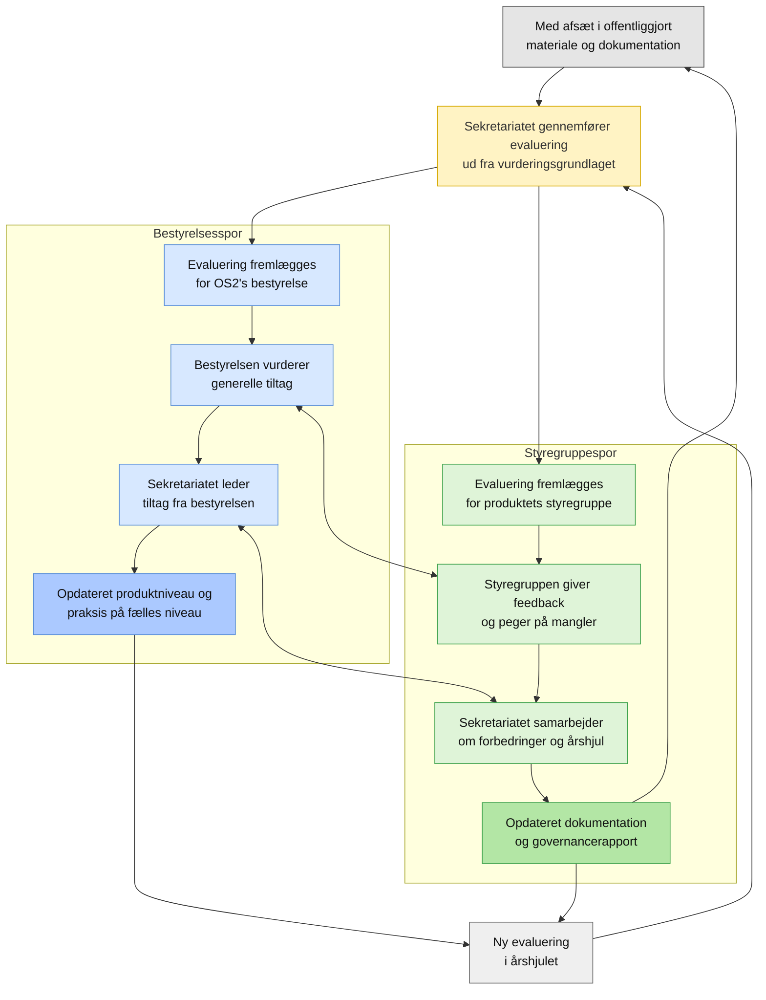

# Evalueringsrapporter for OS2-produkter

OS2-sekretariatet er i gang med at udarbejde de første samlede evalueringer af produkter i porteføljen. Ikke alle produkter er vurderet endnu, og flere rapporter vil blive tilføjet løbende. Styregrupper og produktkoordinatorer vil også blive inddraget når rapporter er udarbejdet.

Bestyrelsen har igangsat arbejdet for at skabe et klart overblik over porteføljen og for at styrke den fælles professionalisering af OS2’s produkter. Evalueringerne giver et fælles grundlag for dialog, prioritering og videreudvikling i produktfællesskaberne.

Denne side opdateres, efterhånden som nye evalueringer bliver færdige.

## Processen

## Tilgængelige evalueringer

- [OS2-SkadesØkonomi](./docs/os2-skadesøkonomi_assessment)  
- [OS2autoproces](./docs/os2autoproces_assessment)  
- [OS2faktor](./docs/os2faktor_assessment)  
