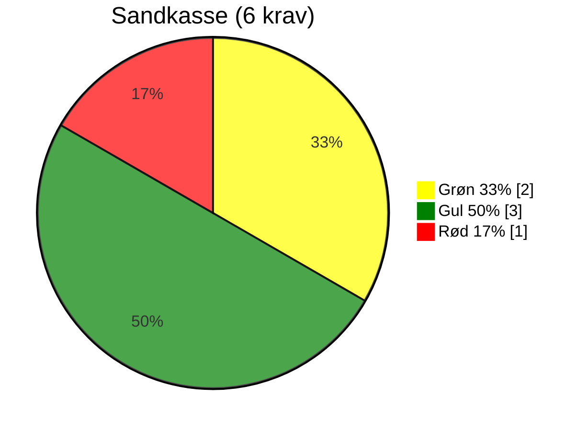
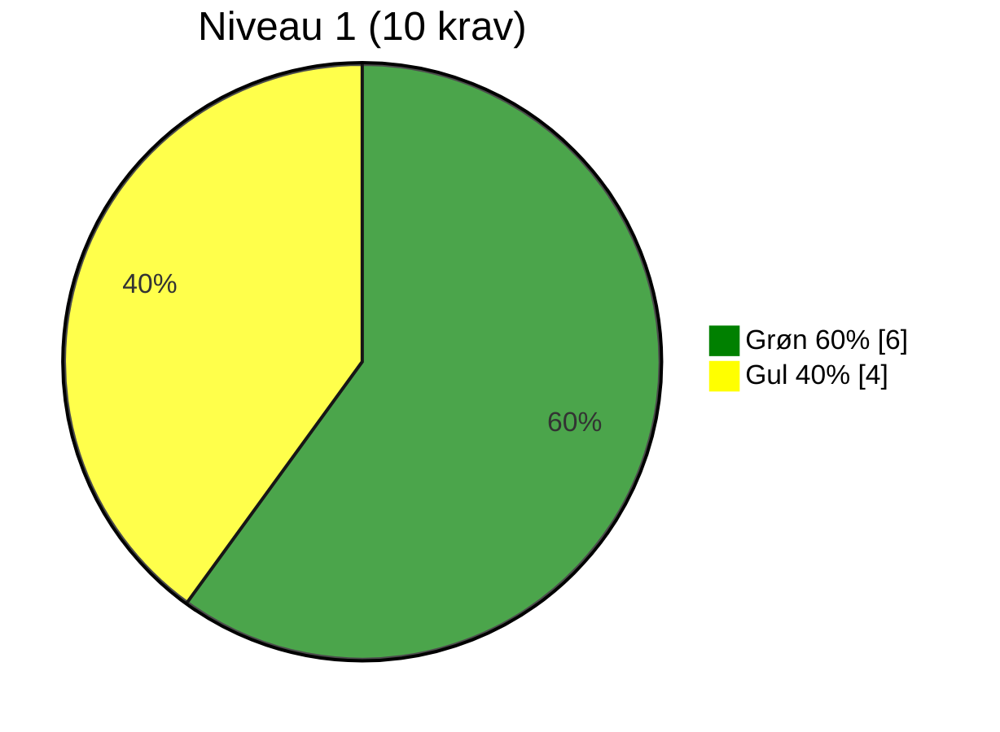
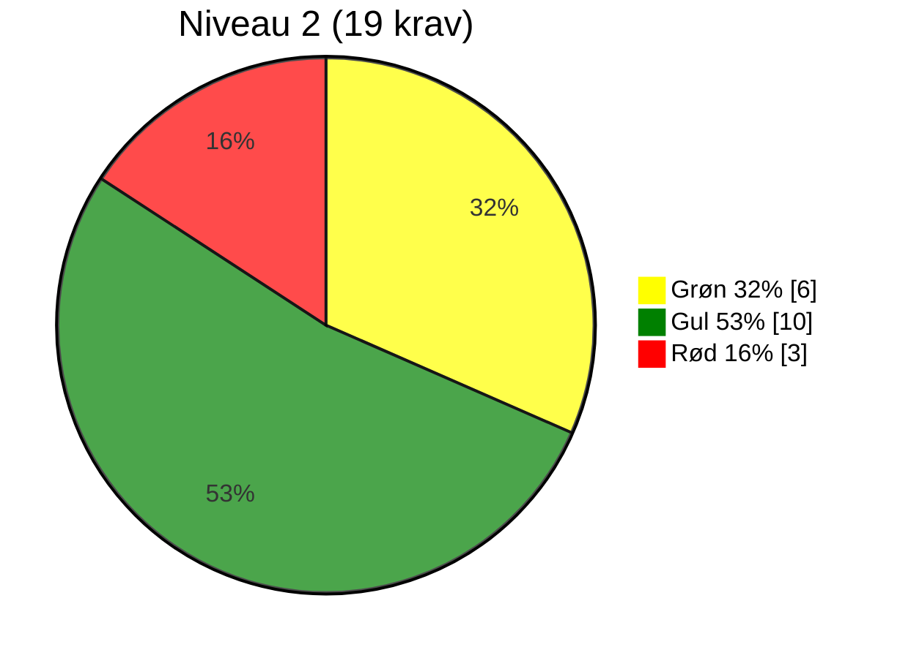
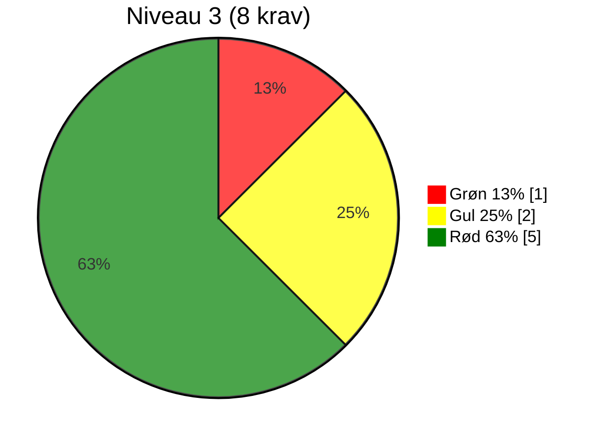
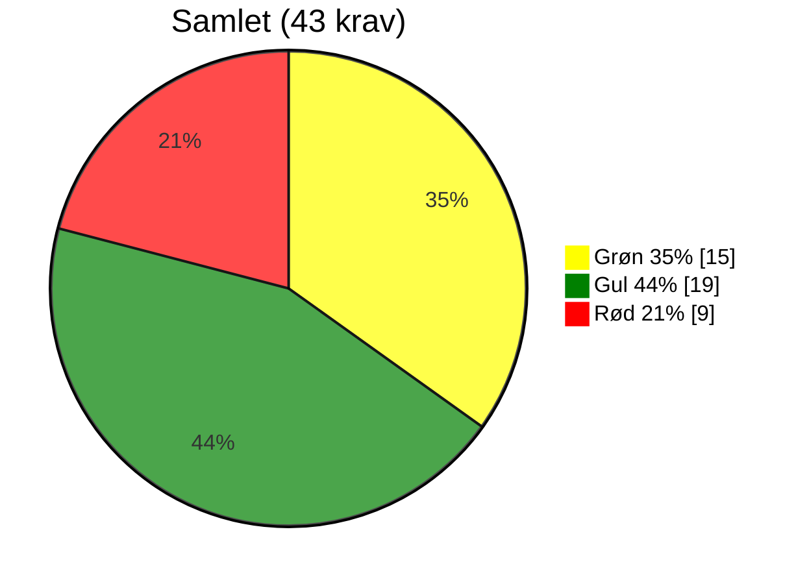

# Vurdering af OS2-produkt: OS2autoproces

## 📄 Dokumentinformation  
> **Evalueringsskabelon version:** 0.9  
> **Dato for release:** [05-09-2025]  
> **Audit made by:** Rasmus Frey, rasmus@os2.eu  
> **GitHub organisation:** https://github.com/os2autoproces  
> **OS2 website link:** https://www.os2.eu/os2autoproces

## 📝 Resumé

OS2autoproces har et solidt fundament og leverer tydelig værdi gennem videndeling om automatisering af arbejdsgange i flere kommuner og regioner. Produktet er officielt forankret i OS2 og har styrker i licens, åben kode og etableret styregruppe. Revisionen peger dog på flere gule og røde områder inden for dokumentation, sikkerhed, transparens og governance. På den baggrund anbefales det at fastholde produktet på **niveau 1** i OS2’s governancemodel, med fokus på at modne de svagere områder og dermed skabe grundlag for et muligt løft til niveau 2.

## 🔍 Vurdering af alle krav

### 🌍 RELEVANS

| #   | Niveau    | Krav                                             | Vurderingskriterie                                                                  | Vurdering     | Vurderingsgrundlag    |
|-----|-----------|--------------------------------------------------|-------------------------------------------------------------------------------------|---------------|-----------------------|
| R1  | Sandkasse | Løsningen skaber lokal værdi                     | Standard: Produktet giver konkret og dokumenterbar værdi for den enkelte myndighed. | 🟢 | Deling af viden om automatisering af manuelle arbejdsgange reducerer tidsforbrug i kommuner. |
| R2  | 2         | Løsningen er accepteret af lokal linjeledelse    | Standard: Linjeledelsen har bakket op om deltagelsen i udviklingen og anvendelsen.  | 🟡 | Ikke tydeligt dokumenteret, men det fremgår at flere kommuner og regioner bakker op om løsningen er tilsluttet. Ligeledes deltager KL og KOMBIT i styregruppen. |
| R3  | 2         | Løsningen har fælles offentligt potentiale       | Standard: Kan skabe værdi og genbruges på tværs af myndigheder.                     | 🟢 | Flere kommuner og regioner anvender allerede produktet; potentiale for bred udbredelse. |
| R4  | 3         | Ophæng til nationale strategier er til stede     | Standard: Understøtter fx digitaliseringsstrategi og fællesoffentlige mål.          | 🟡 | Understøtter effektivisering, men ingen dokumenteret kobling til nationale strategier. |

### 🛠️ FORMKRAV

| #    | Niveau    | Krav                                                                         | Vurderingskriterie                                                                               | Vurdering     | Vurderingsgrundlag    |
|------|-----------|------------------------------------------------------------------------------|--------------------------------------------------------------------------------------------------|---------------|-----------------------|
| F1   | Sandkasse | Kildekode til projektet udvikles synligt og aktivt i et OS2-repositorie      | Standard: Kodebasen er tilgængelig og udvikles åbent på GitHub i OS2-kontrolleret organisation.  | 🟡 | Kildekode ligger i en OS2 GitHub-organisationen. Men udvikles ikke åbent og transparent, det fremgår at der lavet et samlet commit når man udgiver nyt release. Altså anvendes code-dump. |
| F2   | Sandkasse | Open Source-licenskriterier overholdes                                       | Standard: Godkendt Open Source Licens (fx MPL-2.0) er tydeligt angivet og anvendt.               | 🟢 | En MPL 2.0 licens er angivet i repo. |
| F3   | Sandkasse | Udbudsregler og almindelig lovformlighed er overholdt                        | Standard: Projektet følger udbudsregler og gældende lovgivning.                                  | 🟡 | Ikke offentligt dokumenteret, men OS2’s model følges. |
| F4   | Sandkasse | Der er tænkt på sikkerheden i løsningen                                      | Standard: Der forefindes dokumenteret sikkerhedsarbejde og/eller procedurer.                     | 🔴 | Ingen offentlig dokumentation af sikkerhedshåndtering. |
| F5   | Sandkasse | Løsningens formål og værdi er beskrevet                                      | Standard: Formål og værdi er klart beskrevet, gerne i en README tilknyttet kodebasen.            | 🟡 | Produktsiden beskriver værdi, men README er begrænset. |
| F6   | 1         | Kildekoden er overdraget og placeret under OS2's GitHub                      | Standard: Koden er juridisk overdraget og hostes under OS2's GitHub.                             | 🟢 | Repo placeret under OS2-org. |
| F7   | 1         | Dokumentation udarbejdes med og overholder OS2's standardskabelon            | Standard: Dokumentation i åbent format (fx Markdown) og OS2’s skabelon anvendt.                  | 🟡 | Dokumentation findes, men følger ikke OS2’s standard. |
| F10  | 1         | OS2's kommunikationskanaler anvendes                                         | Standard: Information findes på os2.eu.                                                          | 🟢 | Produktside findes på os2.eu. |
| F11  | 1         | Offentlig issue-tracking anvendes                                            | Standard: Opgaver (issues) og kodeændringer spores offentligt og tilknyttes GitHub.              | 🟡 | Der anvendes ikke issues på Github, men Jira anvendes og hvis man finder linket er denne offentlig tilgængelig. Issue-tracker anvendes uden kobling til repo og kildekode. |
| F12  | 2         | Kun én version af core-koden (master)                                        | Standard: Ingen parallelle versioner af kodebasen.                                               | 🟡 | Én main branch er i brug, men der udvikles ikke aktivet på Github. Det er derfor ikke tydeligt om der eksisterer en parallel version af kildekoden som er den der udvikles på og anvendes i drift. |
| F13  | 2         | Præsentationsmateriale af løsningen er udarbejdet                            | Standard: Der findes præsentationer om produktet.                                                | 🟢 | Slides og videoer linket via produktsiden. |
| F14  | 2         | Kommunikationsmateriale til strategisk niveau                                | Standard: Der findes materialer målrettet ledelse og strategi.                                   | 🟡 | Business case omtalt, men materiale til ledelsesniveau kan styrkes. |
| F15  | 2         | Best practice for implementering i organisationen dokumenteres               | Standard: Vejledninger og erfaringer er beskrevet.                                               | 🟢 | Kom-i-gang vejledning findes på produktsiden og via links i README. |
| F16  | 2         | Teknisk dokumentation indeholder best practice for kodestandarder            | Standard: Kodestandarder dokumenteret, relevant dokumentation til udviklere.                     | 🟡 | Begrænset udviklerdokumentation på GitHub. |
| F17  | 2         | Drifts- og vedligeholdelsessetup er beskrevet                                | Standard: Driftmiljø og procedurer for vedligehold beskrevet.                                    | 🟡 | Ikke detaljeret dokumenteret og er derfor ikke umiddelbart replikerbart. |
| F18  | 2         | Rammearkitektur og standarder er fulgt og afvigelser forklaret               | Standard: Overensstemmelse med rammearkitektur er beskrevet.                                     | 🟡 | Ikke eksplicit nævnt og dokumenteret, men formodes at følge praksis. |
| F19  | 2         | Løsningen leveret i containerformat                                          | Standard: Fx Docker anvendes.                                                                    | 🟢 | Docker-compose konfiguration findes. |
| F20  | 2         | Uddannelsesmateriale er udarbejdet                                           | Standard: Undervisningsmaterialer findes.                                                        | 🔴 | Der er umiddelbart ikke udarbejdet brugervendt materiale. |
| F21  | 3         | Politisk kommunikation er udarbejdet                                         | Standard: Materialer målrettet politikere og offentlighed er udarbejdet.                         | 🔴 | Ingen dedikeret politikerrettet materiale. |
| F22  | 3         | Procesplan og procesansvar for drift er udarbejdet                           | Standard: Dokumenteret proces og ansvar ifm. idriftsættelse.                                     | 🔴 | Ikke dokumenteret offentligt. |

### 🏛️ STRATEGISK SAMMENHÆNG

| #   | Niveau    | Krav                                                       | Vurderingskriterie                                                    | Vurdering     | Vurderingsgrundlag    |
|-----|-----------|------------------------------------------------------------|-----------------------------------------------------------------------|---------------|-----------------------|
| S1  | 1         | Produktet har kobling til OS2's strategi                   | Standard: Understøtter OS2’s mission og vision.                       | 🟢 | Matcher OS2’s strategi om at dele og genbruge digitale løsninger. |
| S2  | 1         | Løsningen understøtter innovation og open source           | Standard: Fremmer innovation og åbenhed.                              | 🟢 | Automatisering af arbejdsgange fremmer effektivitet og innovation. |
| S3  | 2         | Kobling til OS2's mission, vision og strategi er beskrevet | Standard: Forbindelsen er beskrevet.                                  | 🟡 | Produktsiden beskriver formål, men uden eksplicit strategisk kobling. |
| S4  | 2         | Vision og strategi for produktet er udarbejdet             | Standard: Der findes en formel vision og strategi for produktet.      | 🟡 | Vision omtalt, men ikke detaljeret dokumenteret og der er ikke tegn på nogen strategi. |
| S5  | 3         | Produktets overensstemmelse med OS2's vision og strategi   | Standard: Tydelig sammenhæng og beskrivelse.                          | 🟢 | Støtter åbenhed og fælles ejerskab. |

### 👥 GOVERNANCE

| #    | Niveau    | Krav                                                       | Vurderingskriterie                                                            | Vurdering     | Vurderingsgrundlag    |
|------|-----------|------------------------------------------------------------|-------------------------------------------------------------------------------|---------------|-----------------------|
| G1   | 1         | Produktet er oprettet i OS2's porteføljestyring            | Standard: Findes i OS2’s porteføljedatabase, hjemmeside og årshjul.           | 🟢 | Produktside findes på os2.eu. |
| G2   | 1         | Der koordineres løbende med OS2-sekretariatet              | Standard: Der er løbende kontakt med sekretariatet.                           | 🟡 | Sekretariat inddraget, men uden fast struktur. |
| G3   | 1         | Projektleder/tovholder er udpeget                          | Standard: Der er udpeget en fast kontaktperson/koordinator.                   | 🟡 | Produktkoordinator tilknyttet men ikke klart fremhævet i f.eks. README. |
| G4   | 1         | Bestyrelsen er orienteret                                  | Standard: Bestyrelsen kender til projektet.                                   | 🟢 | Produkt er udviklet i regi af OS2 og er optaget i OS2-porteføljen. |
| G5   | 2         | Bestyrelsen har godkendt produktet                         | Standard: Formelt godkendt i referater.                                       | 🟡 | Formodentlig godkendt, men kan ikke finde det dokumenteret offentligt. |
| G6   | 2         | Der er nedsat en styregruppe                               | Standard: Der findes en aktiv styregruppe.                                    | 🟢 | Styregruppe findes og mødes aktivt. Referater er offentliggjort. |
| G7   | 2         | Der er nedsat en koordinationsgruppe                       | Standard: Der findes en aktiv koordinationsgruppe.                            | 🟡 | Der er formentlig en koordinationsgruppe men om den er aktiv er ikke dokumenteret. Der offentliggøres ikke mødereferater. |
| G8   | 2         | Projektmodel anvendes og dokumenteret (anbefaling)         | Standard: Der arbejdes efter en dokumenteret projektmodel.                    | 🔴 | Ikke dokumenteret. |
| G9   | 2         | Review af kode foretages af tredjepart (anbefaling)        | Standard: Uafhængig kodegennemgang gennemføres og procedure er beskrevet.     | 🔴 | Ingen dokumentation for review. |
| G10  | 2         | Tilslutningserklæring til sikring af økonomi (anbefaling)  | Standard: OS2-tilslutningsaftale findes og er effektueret.                    | 🟢 | Tilslutningsaftale findes. |
| G11  | 3         | Bestyrelsen har godkendt styregruppen                      | Standard: Formelt godkendt i referater.                                       | 🔴 | Ikke dokumenteret. |
| G12  | 3         | Bestyrelsen er repræsenteret i styregruppen                | Standard: Bestyrelsesmedlem deltager.                                         | 🔴 | Ingen tegn på bestyrelsesrepræsentation. |
| G13  | 3         | Aftale sikrer økonomi til koordinering og videreudvikling  | Standard: Aftaler om finansiering er på plads og budget udarbejdet.           | 🟡 | Tilslutningsaftale findes, men økonomien virker begrænset da der ikke er tilstrækkelig med råderum til udvikling. |
| G14  | 3         | Fagligt fællesskab bag løsningen                           | Standard: Aktivt fællesskab, fx brugerklub, forum eller andet netværk.        | 🔴 | Ingen tegn på aktivt fællesskab eller brugerklub og ingen formel struktur er beskrevet. |

## 📊 Optælling af vurderinger pr. niveau og tema

| Niveau      | 🟢 Grøn  | 🟡 Gul   | 🔴 Rød   | I alt |
|-------------|----------|---------|---------|---------|
| Sandkasse   | 2        | 3       | 1       | 6       |
| Niveau 1    | 6        | 4       | 0       | 10      |
| Niveau 2    | 6        | 10      | 3       | 19      |
| Niveau 3    | 1        | 2       | 5       | 8       |
| **Samlet**  | 15       | 19      | 9       | 43      |

| Tema / Niveau        | Sandkasse (6 krav)   | Niveau 1 (6+10 krav) | Niveau 2 (19 + 16 krav) | Niveau 3 >(8 + 35 krav) | Total                   |
|----------------------|--------------------------|--------------------------|-----------------------------|-----------------------------|-------------------------|
| Relevans             | 🟢 1                    |                           | 🟢 1 🟡 1                  | 🟡 1                        | 🟢 2 🟡 2              |
| Formkrav             | 🟢 1 🟡 3 🔴 1         | 🟢 2 🟡 2                | 🟢 3 🟡 5 🔴 1              | 🔴 2                        | 🟢 6 🟡 10 🔴 4       |
| Strategisk sammenhæng|                         | 🟢 2                     | 🟡 2                        | 🟢 1                        | 🟢 3 🟡 2              |
| Governance           |                         | 🟢 2 🟡 2                | 🟢 2 🟡 2 🔴 2             | 🟡 1 🔴 3                   | 🟢 4 🟡 5 🔴 5         |
| **Samlet** | 🟢 2 (33%)  🟡 3 (50%)  🔴 1 (17%) | 🟢 6 (60%)  🟡 4 (40%) | 🟢 6 (32%)  🟡 10 (53%)  🔴 3 (16%) | 🟢 1 (14%)  🟡 2 (29%)  🔴 5 (57%) | 🟢 15 (35%)  🟡 19 (44%)  🔴 9 (21%) |

<!--
Nedenfor er mermaid kode til at vise procentfordeling i lagkagediagrammer.
Bemærk at mermaid renderer efter størrelse på værdi. Så er Grøn størst vil det være pie1, men er rød størst vil det være pie1. Derfor skal du ændre på themeVariables så farvekoder bliver korrekte.

Color codes used:
Green: 008000
Yellow: FFFF00
Red: FF0000
-->

## 🏷️ Hvad betyder trafiklysene?

- 🟢 **Grøn** → Kravet er fuldt opfyldt og fungerer som forventet.
- 🟡 **Gul** → Kravet er delvist opfyldt, men der er mangler, som bør adresseres.
- 🔴 **Rød** → Kravet er ikke opfyldt, og der er behov for handling.

## 📋 Hvordan bruges optællingen?

- **Sandkasse:** Grundlæggende formalia – mange 🔴 her betyder, at produktet skal løftes bare for at blive betragtet som OS2-kompatibelt.  
- **Niveau 1:** Basis governance og dokumentation – – mange 🟡 eller 🔴 her peger på udfordringer med at skabe overblik og ejerskab.   
- **Niveau 2:** Drift, vedligehold og strategisk understøttelse – mange 🟡 eller 🔴 her peger på modenhedsproblemer.  
- **Niveau 3:** Avanceret governance og fællesskab – et område, hvor ikke alle produkter nødvendigvis når i mål, men som er ønskværdigt for stabile og bæredygtige produkter.

Ud fra optællingen kan vi vurdere, hvor produktet står samlet set:

- Mange 🟢 → Produktet er solidt forankret i governance-kravene.
- Mange 🟡 → Produktet har et godt grundlag, men kræver en prioriteret indsats på udvalgte områder.
- Mange 🔴 → Produktet har alvorlige governance-mangler og kræver en struktureret genopretning.

### 🔍 Overordnet vurdering

OS2autoproces står stærkt som et produkt, der allerede er i brug i flere kommuner og regioner, og som har dokumenteret værdi gennem videndeling om automatisering af arbejdsgange. Revisionen viser, at fundamentet er solidt: licensforholdene er på plads, koden er placeret i en OS2-kontrolleret GitHub-organisation, og der er etableret en aktiv styregruppe med bred deltagelse.

Samtidig peger vurderingen på flere udfordringer, især på **formkrav** og **governance**, hvor en større andel af kravene er vurderet som gule eller røde. Det gælder særligt områder som sikkerhed, dokumentation, brug af fælles værktøjer (fx issue-tracking) samt tydeligere strategisk kobling og fællesskabsopbygning. Disse forhold trækker ned i den samlede modenhed.

På den baggrund vurderes OS2autoproces at være placeret på **niveau 1 i OS2’s governancemodel**. Produktet har et godt fundament og viser potentiale til at løftes videre til niveau 2, hvis de identificerede forbedringsområder prioriteres.

### 📈 Anbefaling

Det anbefales, at OS2autoproces fastholdes på **niveau 1** i governancemodellen. Produktet har styrker, der gør det til et værdifuldt fællesoffentligt redskab, men der bør arbejdes målrettet med følgende indsatsområder for at realisere potentialet og på sigt bevæge sig mod niveau 2:

- **Sikkerhed:** Etablering af tydelig sikkerhedsdokumentation (fx *SECURITY.md* og trusselsmodeller).
- **Dokumentation:** Opdatering og standardisering af teknisk og organisatorisk dokumentation efter OS2s standard.
- **Transparens:** Overgang fra "code dumps" til løbende udvikling i åbne repos samt aktiv brug af offentlig issue-tracking.
- **Governance:** Formalisering af en brugerklub og fagligt fællesskabet samt koordinationsgruppe og anvendelse af en tydeligere projektmodel.
- **Strategisk kommunikation:** Styrkelse af politisk rettet materiale og bedre kobling til nationale strategier.

Med disse tiltag kan OS2autoproces styrke både kvaliteten og gennemsigtigheden og dermed skabe endnu større værdi for fællesskabet. Produktet anbefales derfor fastholdt på niveau 1 med et klart potentiale til at avancere.
