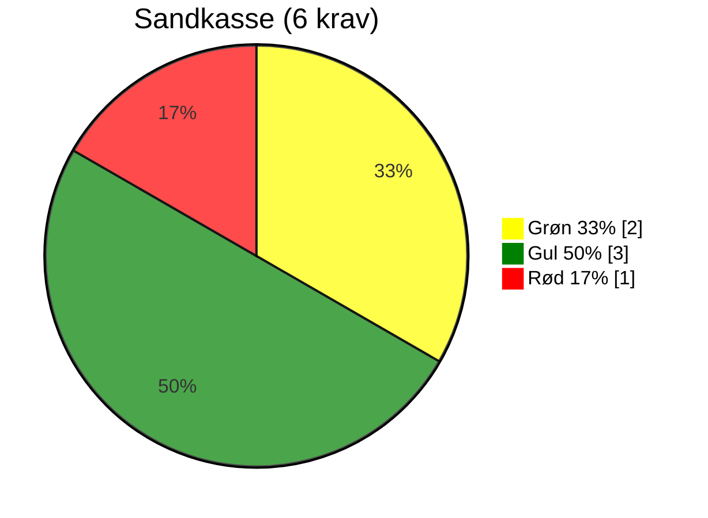
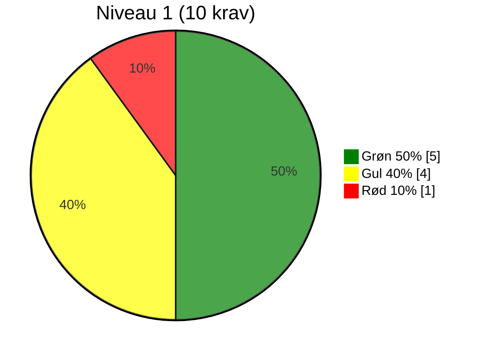
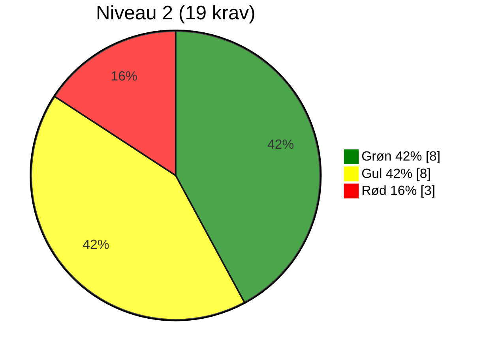
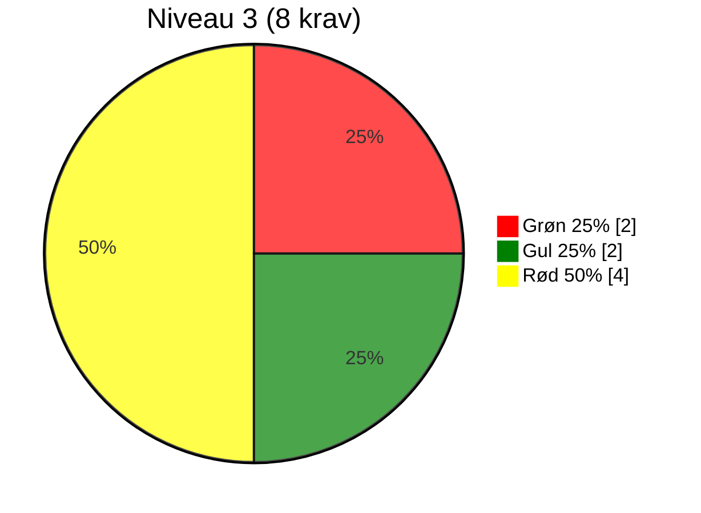
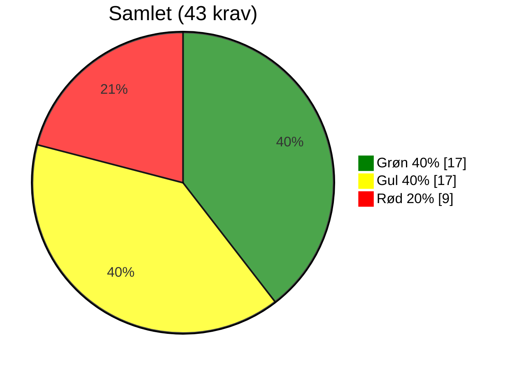

# Evaluering af OS2-produkt: OS2-SkadesØkonomi

> **📄 Dokumentinformation**  
> **Evalueringsskabelon version:** 0.9  
> **Dato for release:** 05-09-2025  
> **Revision udført af:** Rasmus Frey, rasmus@os2.eu  
> **GitHub organisation:** https://github.com/Skadesokonomi  
> **OS2 website link:** https://www.os2.eu/os2skadesokonomi  

## 📝 Resumé

OS2-SkadesØkonomi har et godt fundament og tydeligt potentiale, men står endnu ikke helt stærkt på niveau 1, da flere krav kun er delvist opfyldt. Produktet leverer værdi og er relevant for flere kommuner, men bør arbejde målrettet på at styrke dokumentation, sikkerhed og governance. Det anbefales at fastholde placeringen på niveau 1 og fokusere på at modne de gule områder til grønne for at gøre produktet mere robust.

## 🌍 RELEVANS

| #   | Niveau    | Krav                                             | Vurderingskriterie                                                                  | Vurdering     | Vurderingsgrundlag    |
|-----|-----------|--------------------------------------------------|-------------------------------------------------------------------------------------|---------------|-----------------------|
| R1  | Sandkasse | Løsningen skaber lokal værdi                     | Standard: Produktet giver konkret og dokumenterbar værdi for den enkelte myndighed. | 🟢 | Dokumenteret brug i flere kommuner (fx Svendborg, Kerteminde). |
| R2  | 2         | Løsningen er accepteret af lokal linjeledelse    | Standard: Linjeledelsen har bakket op om deltagelsen i udviklingen og anvendelsen.  | 🟡 | Ikke eksplicit dokumenteret, men understøttet af KL samt en bred styregruppe. |
| R3  | 2         | Løsningen har fælles offentligt potentiale       | Standard: Kan skabe værdi og genbruges på tværs af myndigheder.                     | 🟢 | Kan anvendes på tværs af kommuner og er et fælles produkt i OS2. |
| R4  | 3         | Ophæng til nationale strategier er til stede     | Standard: Understøtter fx digitaliseringsstrategi og fællesoffentlige mål.          | 🟡 | Ingen tydelig kobling, men understøtter effektiv ressourceudnyttelse og klimatilpasning. |

## 🛠️ FORMKRAV

| #    | Niveau    | Krav                                                                         | Vurderingskriterie                                                                               | Vurdering     | Vurderingsgrundlag    |
|------|-----------|------------------------------------------------------------------------------|--------------------------------------------------------------------------------------------------|---------------|-----------------------|
| F1   | Sandkasse | Kildekode til projektet udvikles synligt og aktivt i et OS2-repositorie      | Standard: Kodebasen er tilgængelig og udvikles åbent på GitHub i OS2-kontrolleret organisation.  | 🟡 | Koden er åben og ligger i OS2 kontrolleret GitHub organisation *Skadesokonomi*. Der udvikles delvist åbent med adgang til commit historik men der er ingen kobling til issues og der anvendes ikke pull-requests. Standarder for åben og transparent udvikling følges ikke. |
| F2   | Sandkasse | Open Source-licenskriterier overholdes                                       | Standard: Godkendt Open Source Licens (fx MPL-2.0) er tydeligt angivet og anvendt.               | 🟢 | GPL-3.0 licens angivet i repo. |
| F3   | Sandkasse | Udbudsregler og almindelig lovformlighed er overholdt                        | Standard: Projektet følger udbudsregler og gældende lovgivning.                                  | 🟡 | Udbudsgrundlag ikke offentligt dokumenteret. Økonomien er dog umiddelbart under udbudsgrænser ligesom produktet er doneret fra GeoFyn. |
| F4   | Sandkasse | Der er tænkt på sikkerheden i løsningen                                      | Standard: Der forefindes dokumenteret sikkerhedsarbejde og/eller procedurer.                     | 🔴 | Ingen SECURITY.md eller trusselsmodel. |
| F5   | Sandkasse | Løsningens formål og værdi er beskrevet                                      | Standard: Formål og værdi er klart beskrevet, gerne i en README tilknyttet kodebasen.            | 🟡 | God beskrivelse på OS2’s hjemmeside, men README på GitHub er sparsom. |
| F6   | 1         | Kildekoden er overdraget og placeret under OS2's GitHub                      | Standard: Koden er juridisk overdraget og hostes under OS2's GitHub.                             | 🟢 | Placeret hos OS2 i en OS2 kontrolleret GitHub organisation. |
| F7   | 1         | Dokumentation udarbejdes med og overholder OS2's standardskabelon            | Standard: Dokumentation i åbent format (fx Markdown) og OS2’s skabelon anvendt.                  | 🟡 | Dokumentation findes, men i lukkede formater og af ældre dato. Dokumentation følger ikke OS2-standard. |
| F10  | 1         | OS2's kommunikationskanaler anvendes                                         | Standard: Information findes på os2.eu.                                                          | 🟢 | Produktside og "kom i gang" findes på os2.eu. |
| F11  | 1         | Offentlig issue-tracking anvendes                                            | Standard: Opgaver (issues) og kodeændringer spores offentligt og tilknyttes GitHub.              | 🔴 | Der findes et lille antal meget gamle issues i GitHub-repo men derudover er der ingen offentlig issue-tracker |
| F12  | 2         | Kun én version af core-koden (master)                                        | Standard: Ingen parallelle versioner af kodebasen.                                               | 🟢 | En main-branch er i brug; umiddelbart ingen parallelle forks. |
| F13  | 2         | Præsentationsmateriale af løsningen er udarbejdet                            | Standard: Der findes præsentationer om produktet.                                                | 🟢 | Webinarer, præsentationer og artikler tilgængelige via OS2. |
| F14  | 2         | Kommunikationsmateriale til strategisk niveau                                | Standard: Der findes materialer målrettet ledelse og strategi.                                   | 🟢 | Business case og ledelsesrettet vinkel beskrevet på OS2s hjemmeside. |
| F15  | 2         | Best practice for implementering i organisationen dokumenteres               | Standard: Vejledninger og erfaringer er beskrevet.                                               | 🟢 | "Kom i gang"-vejledning, manualer og erfaringer er tilgængelige. |
| F16  | 2         | Teknisk dokumentation indeholder best practice for kodestandarder            | Standard: Kodestandarder dokumenteret, relevant dokumentation til udviklere.                     | 🟡 | Begrænset udviklerdokumentation på GitHub. Er dog ikke udarbejdet i et åbent format som overholder OS2s anbefalinger. |
| F17  | 2         | Drifts- og vedligeholdelsessetup er beskrevet                                | Standard: Driftmiljø og procedurer for vedligehold beskrevet.                                    | 🟡 | Overordnet model fremgår, men releaseproces og detaljer mangler. |
| F18  | 2         | Rammearkitektur og standarder er fulgt og afvigelser forklaret               | Standard: Overensstemmelse med rammearkitektur er beskrevet.                                     | 🟡 | Bruger QGIS og åbne datasæt, men uden eksplicit reference til arkitekturprincipper. |
| F19  | 2         | Løsningen leveret i containerformat                                          | Standard: Fx Docker anvendes.                                                                    | 🟡 | Desktop/QGIS-værktøj, container ikke relevant men uden noteret undtagelse. |
| F20  | 2         | Uddannelsesmateriale er udarbejdet                                           | Standard: Undervisningsmaterialer findes.                                                        | 🟢 | Videovejledninger og webinarer findes. Dog af ældre karakter. |
| F21  | 3         | Politisk kommunikation er udarbejdet                                         | Standard: Materialer målrettet politikere og offentlighed er udarbejdet.                         | 🔴 | Brugercases findes, men ingen dedikeret politiker-onepager. |
| F22  | 3         | Procesplan og procesansvar for drift er udarbejdet                           | Standard: Dokumenteret proces og ansvar ifm. idriftsættelse.                                     | 🔴 | Overordnet beskrevet, men ingen detaljeret offentlig plan. |

## 🏛️ STRATEGISK SAMMENHÆNG

| #   | Niveau    | Krav                                                       | Vurderingskriterie                                                    | Vurdering     | Vurderingsgrundlag    |
|-----|-----------|------------------------------------------------------------|-----------------------------------------------------------------------|---------------|-----------------------|
| S1  | 1         | Produktet har kobling til OS2's strategi                   | Standard: Understøtter OS2’s mission og vision.                       | 🟢 | Matcher mission og værdiskabelse i OS2. |
| S2  | 1         | Løsningen understøtter innovation og open source           | Standard: Fremmer innovation og åbenhed.                              | 🟢 | Open source QGIS-løsning som anvender data til værdiskabelse. Vurderes at fremme innovation. |
| S3  | 2         | Kobling til OS2's mission, vision og strategi er beskrevet | Standard: Forbindelsen er beskrevet.                                  | 🟡 | Produktsiden beskriver formål, men ikke den eksplicitte strategisk kobling. |
| S4  | 2         | Vision og strategi for produktet er udarbejdet             | Standard: Der findes en formel vision og strategi for produktet.      | 🟡 | Vision nævnes, men uden detaljeret strategi. |
| S5  | 3         | Produktets overensstemmelse med OS2's vision og strategi   | Standard: Tydelig sammenhæng og beskrivelse.                          | 🟢 | Løsningen bidrager til digital suverænitet og fælles ejerskab. |

## 👥 GOVERNANCE

| #    | Niveau    | Krav                                                       | Vurderingskriterie                                                            | Vurdering     | Vurderingsgrundlag    |
|------|-----------|------------------------------------------------------------|-------------------------------------------------------------------------------|---------------|-----------------------|
| G1   | 1         | Produktet er oprettet i OS2's porteføljestyring            | Standard: Findes i OS2’s porteføljedatabase, hjemmeside og årshjul.           | 🟡 | Produktside, kommissorium og takstblad findes. Der er umiddelbart ikke en fast praksis for publisering af relevante dokumenter som f.eks. mødereferater.  |
| G2   | 1         | Der koordineres løbende med OS2-sekretariatet              | Standard: Der er løbende kontakt med sekretariatet.                           | 🟡 | Sekretariatet er tilknyttet men der er ingen fast procedure for orienteringer til sekretariatet eller inddragelse. |
| G3   | 1         | Projektleder/tovholder er udpeget                          | Standard: Der er udpeget en fast kontaktperson/koordinator.                   | 🟡 | Ikke klart angivet om der er en fast koordinator. Den samlede styregruppe fremstår som kontakled. |
| G4   | 1         | Bestyrelsen er orienteret                                  | Standard: Bestyrelsen kender til projektet.                                   | 🟢 | Optaget som OS2-produkt. |
| G5   | 2         | Bestyrelsen har godkendt produktet                         | Standard: Formelt godkendt i referater.                                       | 🔴 | Der foreligger ikke en formel godkendelse. |
| G6   | 2         | Der er nedsat en styregruppe                               | Standard: Der findes en aktiv styregruppe.                                    | 🟢 | Der er etableret en bred Styregruppen med deltagelse fra mange forskellige aktører. |
| G7   | 2         | Der er nedsat en koordinationsgruppe                       | Standard: Der findes en aktiv koordinationsgruppe.                            | 🟡 | Der er ingen dokumentation for en koordinationsgruppe. Det må formodes at styregruppen også dækker denne funktion. |
| G8   | 2         | Projektmodel anvendes og dokumenteret (anbefaling)         | Standard: Der arbejdes efter en dokumenteret projektmodel.                    | 🔴 | Ingen offentlig dokumentation om anvendelse af en projektmodel. |
| G9   | 2         | Review af kode foretages af tredjepart (anbefaling)        | Standard: Uafhængig kodegennemgang gennemføres og procedure er beskrevet.     | 🔴 | Ingen dokumentation for at der foretages review. |
| G10  | 2         | Tilslutningserklæring til sikring af økonomi (anbefaling)  | Standard: OS2-tilslutningsaftale findes og er effektueret.                    | 🟢 | Tilslutningsaftale og takstblad findes. |
| G11  | 3         | Bestyrelsen har godkendt styregruppen                      | Standard: Formelt godkendt i referater.                                       | 🔴 | Der foreligger ikke en formel godkendelse. |
| G12  | 3         | Bestyrelsen er repræsenteret i styregruppen                | Standard: Bestyrelsesmedlem deltager.                                         | 🔴 | Ingen bestyrelsesrepræsentation. |
| G13  | 3         | Aftale sikrer økonomi til koordinering og videreudvikling  | Standard: Aftaler om finansiering er på plads og budget udarbejdet.           | 🟢 | Tilslutningsaftale og takstblad findes men der er ikke midler til koordinering. |
| G14  | 3         | Fagligt fællesskab bag løsningen                           | Standard: Aktivt fællesskab, fx brugerklub, forum eller andet netværk.        | 🟡 | Der er aktivitet, men ingen klar struktur. |

---

### ➡️ Antal krav fordelt på tema

__Bemærk at under formkrav er F8 og F9 sammenlagt med F7__

* Relevans: 4 krav (R1–R4)
* Formkrav: 20 krav (F1–F22)
* Strategisk sammenhæng: 5 krav (S1–S5)
* Governance: 14 krav (G1–G14)
* **I alt: 43 krav**

### ➡️ Antal krav fordelt på niveau

__Bemærk at der nedarves så et niveau 2 produkt skal også efterleve sandkasse og niveau 2.__

* Sandkasse: 6 krav
* Niveau 1: 10 krav
* Niveau 2: 19 krav
* Niveau 3: 8 krav
* **I alt: 43 krav**

---

### 🏷️ Hvad betyder trafiklysene?
- 🟢 **Grøn** → Kravet er fuldt opfyldt og fungerer som forventet.
- 🟡 **Gul** → Kravet er delvist opfyldt, men der er mangler, som bør adresseres.
- 🔴 **Rød** → Kravet er ikke opfyldt, og der er behov for handling.

---

### 📊 Optælling af vurderinger pr. niveau

| Niveau      | 🟢 Grøn  | 🟡 Gul   | 🔴 Rød   | I alt |
|-------------|----------|----------|---------|-------|
| Sandkasse   | 2        | 3        | 1       | 6    |
| Niveau 1    | 5        | 4        | 1       | 10    |
| Niveau 2    | 8        | 8        | 3       | 19    |
| Niveau 3    | 2        | 2        | 4       | 8    |
| **Samlet**  | 17       | 17       | 9       | 43    |

| Tema / Niveau        | Sandkasse (6 krav)     | Niveau 1 (10 krav)   | Niveau 2 (19 krav)   | Niveau 3 (8 krav)    | Total                     |
|----------------------|----------------------------|--------------------------|--------------------------|--------------------------|---------------------------|
| Relevans             | 🟢 1                       |                          | 🟢 1 🟡 1                | 🟡 1                     | 🟢 2 🟡 2                 |
| Formkrav             | 🟢 1 🟡 3 🔴 1            | 🟢 2 🟡 1 🔴 1            | 🟢 5 🟡 4                | 🔴 2                     | 🟢 8 🟡 8 🔴 4            |
| Strategisk sammenhæng|                            | 🟢 2                     | 🟡 2                     | 🟢 1                     | 🟢 3 🟡 2                 |
| Governance           |                            | 🟢 1 🟡 3                | 🟢 2 🟡 1 🔴 3          | 🟢 1 🟡 1 🔴 2           | 🟢 4 🟡 5 🔴 5            |
| **Samlet**           | 🟢 2 (33%)   🟡 3 (50%)   🔴 1 (17%) | 🟢 5 (50%)   🟡 4 (40%)   🔴 1 (10%) | 🟢 8 (42%)   🟡 8 (42%)   🔴 3 (16%) | 🟢 2 (25%)   🟡 2 (25%)   🔴 4 (50%) | 🟢 17 (40%)   🟡 17 (40%)   🔴 9 (20%) |

<!--
Nedenfor er mermaid kode til at vise procentfordeling i lagkagediagrammer.
Bemærk at mermaid renderer efter størrelse på værdi. Så er Grøn størst vil det være pie1, men er rød størst vil det være pie1. Derfor skal du ændre på themeVariables så farvekoder bliver korrekte.
-->

---

### 📋 Hvordan bruges optællingen?

- **Sandkasse:** Grundlæggende formalia – mange 🔴 her betyder, at produktet skal løftes bare for at blive betragtet som OS2-kompatibelt.  
- **Niveau 1:** Basis governance og dokumentation – – mange 🟡 eller 🔴 her peger på udfordringer med at skabe overblik og ejerskab.  
- **Niveau 2:** Drift, vedligehold og strategisk understøttelse – mange 🟡 eller 🔴 her peger på modenhedsproblemer.  
- **Niveau 3:** Avanceret governance og fællesskab – et område, hvor ikke alle produkter nødvendigvis når i mål, men som er ønskværdigt for stabile og bæredygtige produkter.

Ud fra optællingen kan vi vurdere, hvor produktet står samlet set:

- Mange 🟢 → Produktet er solidt forankret i governance-kravene.
- Mange 🟡 → Produktet har et godt grundlag, men kræver en prioriteret indsats på udvalgte områder.
- Mange 🔴 → Produktet har alvorlige governance-mangler og kræver en struktureret genopretning.

---

### 🔍 Overordnet vurdering

OS2-SkadesØkonomi har et godt fundament med åben kildekode, organisering og en officiel plads i OS2-porteføljen. Der er dokumentation af formål og værdi, og løsningen bruges i flere kommuner. Samtidig viser revisionen, at der er et relativt stort antal gule vurderinger på både sandkasse- og niveau 1-krav. Det indikerer, at produktet ikke står helt stærkt på niveau 1 endnu, men snarere befinder sig i en fase, hvor fundamentet er lagt, og potentialet er tydeligt.

---

### 📈 Anbefaling

Det anbefales, at OS2-SkadesØkonomi fastholdes på **niveau 1**, men at fokus i den kommende periode bliver at:

- Konvertere flest mulige gule til grønne, især inden for dokumentation, sikkerhed og organisering.  
- Fastholde enkelheden i governance (der er ikke nødvendigt at stile efter niveau 3).  
- Løbende vurdere, om udvalgte elementer fra niveau 2 kan indføres, hvis produktet vokser i udbredelse. 

➡️ Samlet set vurderes produktet at have **et godt fundament og solidt potentiale** – men arbejdet med at modne niveau 1-kravene er afgørende for at gøre det mere robust i fællesskabet.
