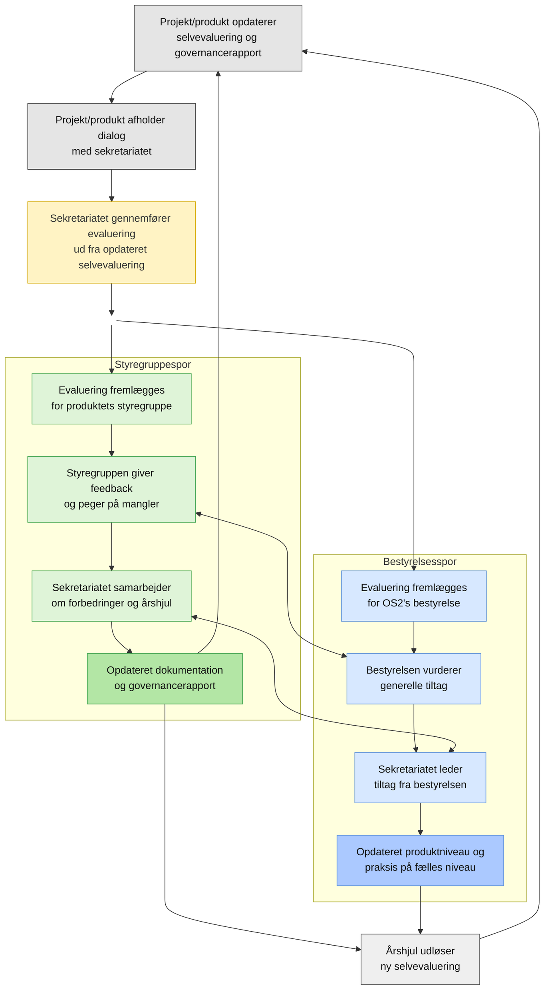

# Introduktion til evalueringsprocessen

OS2 gennemfører evalueringer af alle produkter og projekter to gange årligt som en fast del af fællesskabets kvalitetssikring.

Processen tager afsæt i produktets egen selvevaluering og governancerapport, som opdateres løbende af produktorganisationen. På den baggrund gennemfører sekretariatet en samlet evaluering i dialog med produktet.

Evalueringen behandles i to spor. I produktets styregruppe med fokus på konkrete forbedringer, dokumentation og videre udvikling. Og i OS2’s bestyrelse med fokus på tværgående prioriteringer, produktniveau og fælles praksis.

Resultatet er både en status og et arbejdsgrundlag. Evalueringen peger på udviklingsområder i det enkelte produkt og kan samtidig føre til justeringer på tværs af porteføljen.

Processen gentages som en del af et fast årshjul, hvor opdateret selvevaluering er forudsætningen for næste evaluering. Over tid bør det opleves at arbejdet lettes i takt med, at produkter holder deres selvevaluering ajour og arbejder aktivt med OS2’s styringsmodel.

## Processen

