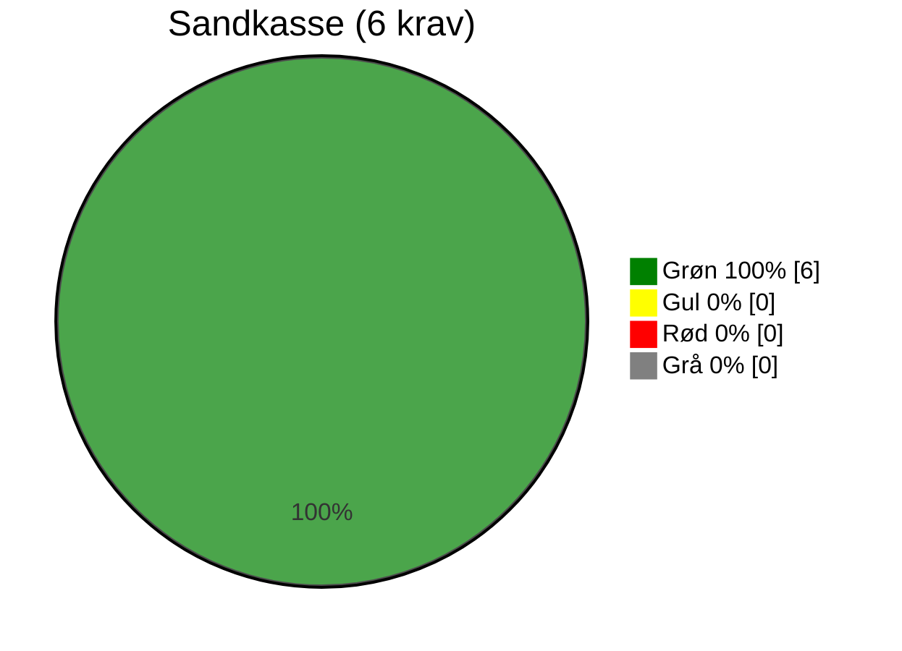
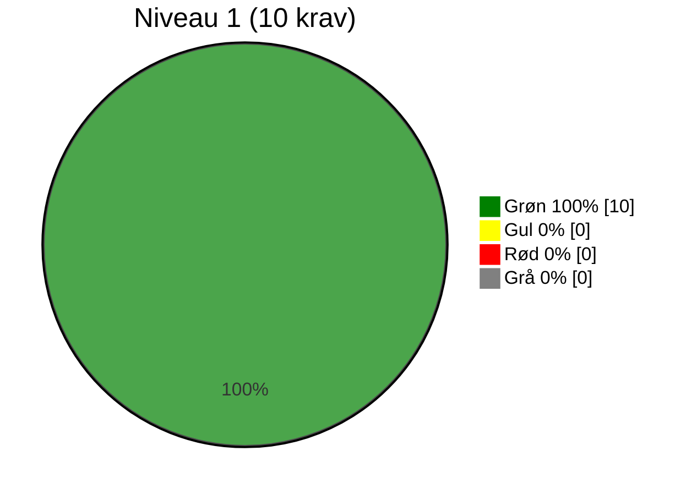
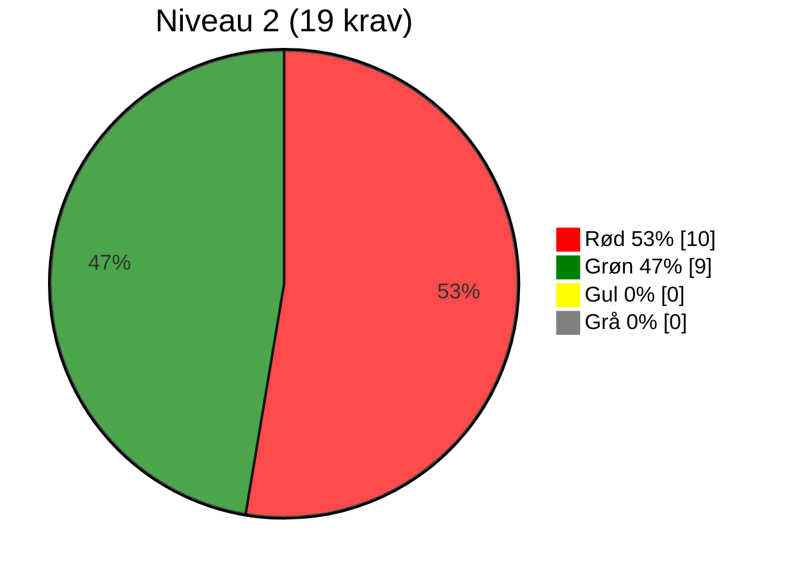
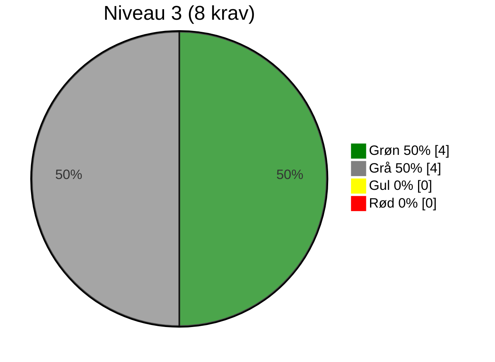
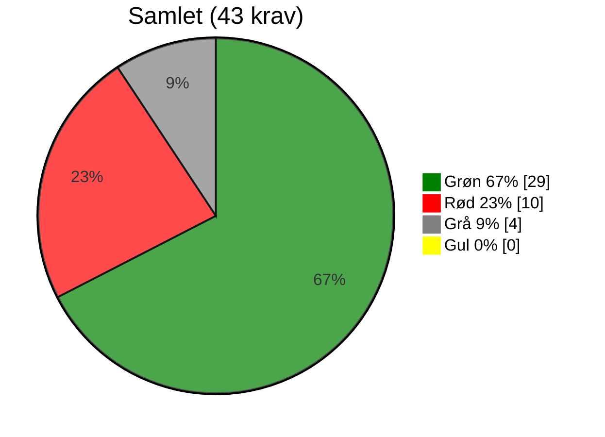

# Evaluering af OS2-produkt: OS2-test-selvevaluering

> **📄 Dokumentinformation** 
> **Version for anvendt evalueringsskabelon:** 0.9.2 
> **Dato for udfyldelse:** 06-05-2026 
> **Evaluering lavet af:** [Navn] 
> **Link til Git organisation:** [indsæt link til git organisation/repo] 

## Resumé
Udfyldes senere.

## Overordnet vurdering
Udfyldes senere.

## Anbefaling
Udfyldes senere.

---

# Evaluering i henhold til krav i OS2s styringsmodel

## RELEVANS

| # | Niveau | Krav | Vurderingskriterie | Vurdering | Vurderingsgrundlag |
|-----|-----------|------|--------------------|-----------|--------------------|
| R1 | Sandkasse | Løsningen skaber lokal værdi | Standard: Produktet giver konkret og dokumenterbar værdi for den enkelte myndighed. | 🟢 | Det er en løsning som hjælper OS2 med at evaluere produktniveau |
| R2 | 2 | Løsningen er accepteret af lokal linjeledelse | Standard: Linjeledelsen har bakket op om deltagelsen i udviklingen og anvendelsen. | 🟢 | OS2 bestyrelse har bedt om og godkendt at alle produkter i OS2 skal foretage selvevaluering. |
| R3 | 2 | Løsningen har fælles offentligt potentiale | Standard: Kan skabe værdi og genbruges på tværs af myndigheder. | 🟢 | Løsningen anvendes bredt i OS2 og det data som løsningen generere er med til at hjælp kommuner og andre offentlig myndigheder i Deres vurdering af OS2-produkter. |
| R4 | 3 | Ophæng til nationale strategier er til stede | Standard: Understøtter fx digitaliseringsstrategi og fællesoffentlige mål. | ⚪ | Det er et internt evalueringsværktøj og ikke umiddelbart relevant i henhold til nationale strategier. |

## FORMKRAV

| # | Niveau | Krav | Vurderingskriterie | Vurdering | Vurderingsgrundlag |
|------|-----------|------|--------------------|-----------|--------------------|
| F1 | Sandkasse | Kildekode til projektet udvikles synligt og aktivt i et OS2-repositorie | Standard: Kodebasen er tilgængelig og udvikles åbent på GitHub i OS2-kontrolleret organisation. | 🟢 | Løsningen udvikles, vedligeholdes og hostes i et OS2 repositorie på Github under organisationen OS2offdig. https://github.com/OS2offdig/os2-product-audits |
| F2 | Sandkasse | Open Source-licenskriterier overholdes | Standard: Godkendt Open Source Licens (fx MPL-2.0) er tydeligt angivet og anvendt. | 🟢 | Der anvendes CC BY SA og MPL 2.0 |
| F3 | Sandkasse | Udbudsregler og almindelig lovformlighed er overholdt | Standard: Projektet følger udbudsregler og gældende lovgivning. | 🟢 | Løsningen er egen udviklet. |
| F4 | Sandkasse | Der er tænkt på sikkerheden i løsningen | Standard: Der forefindes dokumenteret sikkerhedsarbejde og/eller procedurer. | 🟢 | Det er en simple løsning som ikke er kritisk og ikke giver adgang til andre systemer. Løsningen hostes på GitHub Pages and anvender GitHubs sikkerhedsmekanismer. |
| F5 | Sandkasse | Løsningens formål og værdi er beskrevet | Standard: Formål og værdi er klart beskrevet, gerne i en README tilknyttet kodebasen. | 🟢 | Er beskrevet i repo, https://github.com/OS2offdig/os2-product-audits |
| F6 | 1 | Kildekoden er overdraget og placeret under OS2's GitHub | Standard: Koden er juridisk overdraget og hostes under OS2's GitHub. | 🟢 | Kildekode forvaltes og udvikles af OS2-sekretariatet. Det foregår i følgende repo: https://github.com/OS2offdig/os2-product-audits |
| F7 | 1 | Dokumentation udarbejdes med og overholder OS2's standardskabelon | Standard: Dokumentation i åbent format (fx Markdown) og OS2’s skabelon anvendt. | 🟢 | Skabelonen anvendes en til en. |
| F10 | 1 | OS2's kommunikationskanaler anvendes | Standard: Information findes på os2.eu. | 🟢 | Værktøjes publiceres under OS2s governanceinformation of som et subdomæne til os2.eu. På audit.os2.eu. |
| F11 | 1 | Offentlig issue-tracking anvendes | Standard: Opgaver (issues) og kodeændringer spores offentligt og tilknyttes GitHub. | 🟢 | Issue tracker er placeret i repo: https://github.com/OS2offdig/os2-product-audits |
| F12 | 2 | Kun én version af core-koden (master) | Standard: Ingen parallelle versioner af kodebasen. | 🟢 | Der vedligeholdes og udvikles kun en version. |
| F13 | 2 | Præsentationsmateriale af løsningen er udarbejdet | Standard: Der findes præsentationer om produktet. | 🔴 | Ingen data i selvevalueringsrapport. |
| F14 | 2 | Kommunikationsmateriale til strategisk niveau | Standard: Der findes materialer målrettet ledelse og strategi. | 🔴 | Ingen data i selvevalueringsrapport. |
| F15 | 2 | Best practice for implementering i organisationen dokumenteres | Standard: Vejledninger og erfaringer er beskrevet. | 🔴 | Ingen data i selvevalueringsrapport. |
| F16 | 2 | Teknisk dokumentation indeholder best practice for kodestandarder | Standard: Kodestandarder dokumenteret, relevant dokumentation til udviklere. | 🔴 | Ingen data i selvevalueringsrapport. |
| F17 | 2 | Drifts- og vedligeholdelsessetup er beskrevet | Standard: Driftmiljø og procedurer for vedligehold beskrevet. | 🔴 | Ingen data i selvevalueringsrapport. |
| F18 | 2 | Rammearkitektur og standarder er fulgt og afvigelser forklaret | Standard: Overensstemmelse med rammearkitektur er beskrevet. | 🔴 | Ingen data i selvevalueringsrapport. |
| F19 | 2 | Løsningen leveret i containerformat | Standard: Fx Docker anvendes. | 🔴 | Ingen data i selvevalueringsrapport. |
| F20 | 2 | Uddannelsesmateriale er udarbejdet | Standard: Undervisningsmaterialer findes. | 🔴 | Ingen data i selvevalueringsrapport. |
| F21 | 3 | Politisk kommunikation er udarbejdet | Standard: Materialer målrettet politikere og offentlighed er udarbejdet. | ⚪ | Ingen data i selvevalueringsrapport. |
| F22 | 3 | Procesplan og procesansvar for drift er udarbejdet | Standard: Dokumenteret proces og ansvar ifm. idriftsættelse. | ⚪ | Ingen data i selvevalueringsrapport. |

## STRATEGISK SAMMENHÆNG

| # | Niveau | Krav | Vurderingskriterie | Vurdering | Vurderingsgrundlag |
|-----|-----------|------|--------------------|-----------|--------------------|
| S1 | 1 | Produktet har kobling til OS2's strategi | Standard: Understøtter OS2’s mission og vision. | 🟢 | Der er en direkte kobling til OS2s strategiske indsatser. Særligt indsats 3 og 4 - https://www.os2.eu/os2s-vision-og-mission |
| S2 | 1 | Løsningen understøtter innovation og open source | Standard: Fremmer innovation og åbenhed. | 🟢 | Løsningen anvender open source teknologier |
| S3 | 2 | Kobling til OS2's mission, vision og strategi er beskrevet | Standard: Forbindelsen er beskrevet. | 🟢 | Løsningen understøtter direkte arbejdet med OS2s styringsmodel og indplacering af produkter på rette niveau. |
| S4 | 2 | Vision og strategi for produktet er udarbejdet | Standard: Der findes en formel vision og strategi for produktet. | 🟢 | Visionen er at gøre det let for et OS2-produkt at vedligeholde sin egen evaluering i henhold til OS2s styringsmodel. Det er en målsætningen at løsningen skal udvikle sig til i høj grad at automatisere arbejdet med at udfærdige produktevalueringer. |
| S5 | 3 | Produktets overensstemmelse med OS2's vision og strategi | Standard: Tydelig sammenhæng og beskrivelse. | 🟢 | Løsningen er direkte koblet til OS2s formål og bygger på OS2s værdier og vision om at styrke digitaliseringen i Danmark. |

## GOVERNANCE

| # | Niveau | Krav | Vurderingskriterie | Vurdering | Vurderingsgrundlag |
|------|-----------|------|--------------------|-----------|--------------------|
| G1 | 1 | Produktet er oprettet i OS2's porteføljestyring | Standard: Findes i OS2’s porteføljedatabase, hjemmeside og årshjul. | 🟢 | Løsningen er en del at OS2s værktøjskasse og er tilgængelig via OS2s github og dermed også hjemmeside. |
| G2 | 1 | Der koordineres løbende med OS2-sekretariatet | Standard: Der er løbende kontakt med sekretariatet. | 🟢 | Sekretariatet ejer og drive løsningen. |
| G3 | 1 | Projektleder/tovholder er udpeget | Standard: Der er udpeget en fast kontaktperson/koordinator. | 🟢 | Sekretariatschefen er produktejer. |
| G4 | 1 | Bestyrelsen er orienteret | Standard: Bestyrelsen kender til projektet. | 🟢 | Løsningen er et resultat af en bestyrelsesbeslutning. |
| G5 | 2 | Bestyrelsen har godkendt produktet | Standard: Formelt godkendt i referater. | 🔴 | Løsningen er ikke formelt præsenteret og godkendt. |
| G6 | 2 | Der er nedsat en styregruppe | Standard: Der findes en aktiv styregruppe. | 🟢 | Projektet referere til OS2s bestyrelse. |
| G7 | 2 | Der er nedsat en koordinationsgruppe | Standard: Der findes en aktiv koordinationsgruppe. | 🟢 | Ingen data i selvevalueringsrapport. |
| G8 | 2 | Projektmodel anvendes og dokumenteret (anbefaling) | Standard: Der arbejdes efter en dokumenteret projektmodel. | 🟢 | Continuous development and deployment. |
| G9 | 2 | Review af kode foretages af tredjepart (anbefaling) | Standard: Uafhængig kodegennemgang gennemføres og procedure er beskrevet. | 🔴 | Ingen data i selvevalueringsrapport. |
| G10 | 2 | Tilslutningserklæring til sikring af økonomi (anbefaling) | Standard: OS2-tilslutningsaftale findes og er effektueret. | 🟢 | Udgifter dækkes via OS2s centrale budget. |
| G11 | 3 | Bestyrelsen har godkendt styregruppen | Standard: Formelt godkendt i referater. | 🟢 | Det er en kerneopgave for OS2-sekretariatet at porteføljestyre. Betyrelsen har til januar seminar i 2026 besluttet at produkter skal selvevaluere. Heri ligger beslutningen om Audit værktøj. |
| G12 | 3 | Bestyrelsen er repræsenteret i styregruppen | Standard: Bestyrelsesmedlem deltager. | 🟢 | Bestyrelsen udgør styregruppen. |
| G13 | 3 | Aftale sikrer økonomi til koordinering og videreudvikling | Standard: Aftaler om finansiering er på plads og budget udarbejdet. | 🟢 | Dækkes af OS2s budget. |
| G14 | 3 | Fagligt fællesskab bag løsningen | Standard: Aktivt fællesskab, fx brugerklub, forum eller andet netværk. | ⚪ | Ingen data i selvevalueringsrapport. |

# Optælling af vurderinger pr. niveau og tema

| Niveau / Vurdering | 🟢 Grøn | 🟡 Gul | 🔴 Rød | ⚪ Grå |
|-------------------------|---------|--------|--------|--------|
| Sandkasse | 6 | 0 | 0 | 0 |
| Niveau 1 | 10 | 0 | 0 | 0 |
| Niveau 2 | 9 | 0 | 10 | 0 |
| Niveau 3 | 4 | 0 | 0 | 4 |
| **Total** | 29 | 0 | 10 | 4 |

| Tema / Niveau | Sandkasse | Niveau 1 | Niveau 2 | Niveau 3 | Total |
|---|---|---|---|---|---|
| Relevans | 🟢 1 🟡 0 🔴 0 ⚪ 0 | 🟢 0 🟡 0 🔴 0 ⚪ 0 | 🟢 2 🟡 0 🔴 0 ⚪ 0 | 🟢 0 🟡 0 🔴 0 ⚪ 1 | 🟢 3 🟡 0 🔴 0 ⚪ 1 |
| Formkrav | 🟢 5 🟡 0 🔴 0 ⚪ 0 | 🟢 4 🟡 0 🔴 0 ⚪ 0 | 🟢 1 🟡 0 🔴 8 ⚪ 0 | 🟢 0 🟡 0 🔴 0 ⚪ 2 | 🟢 10 🟡 0 🔴 8 ⚪ 2 |
| Strategisk sammenhæng | 🟢 0 🟡 0 🔴 0 ⚪ 0 | 🟢 2 🟡 0 🔴 0 ⚪ 0 | 🟢 2 🟡 0 🔴 0 ⚪ 0 | 🟢 1 🟡 0 🔴 0 ⚪ 0 | 🟢 5 🟡 0 🔴 0 ⚪ 0 |
| Governance | 🟢 0 🟡 0 🔴 0 ⚪ 0 | 🟢 4 🟡 0 🔴 0 ⚪ 0 | 🟢 4 🟡 0 🔴 2 ⚪ 0 | 🟢 3 🟡 0 🔴 0 ⚪ 1 | 🟢 11 🟡 0 🔴 2 ⚪ 1 |

## Hvad betyder trafiklysene?
- 🟢 **Grøn** → Kravet er fuldt opfyldt og fungerer som forventet.
- 🟡 **Gul** → Kravet er delvist opfyldt, men der er mangler, som bør adresseres.
- 🔴 **Rød** → Kravet er ikke opfyldt, og der er behov for handling.
- ⚪ **Grå** → Kravet er ikke relevant og medtages ikke i vurderingen.

## Hvordan bruges optællingen?

- **Sandkasse:** Grundlæggende formalia – mange 🔴 her betyder, at produktet skal løftes bare for at blive betragtet som OS2-kompatibelt.
- **Niveau 1:** Basis governance og dokumentation – – mange 🟡 eller 🔴 her peger på udfordringer med at skabe overblik og ejerskab.
- **Niveau 2:** Drift, vedligehold og strategisk understøttelse – mange 🟡 eller 🔴 her peger på modenhedsproblemer.
- **Niveau 3:** Avanceret governance og fællesskab – et område, hvor ikke alle produkter nødvendigvis når i mål, men som er ønskværdigt for stabile og bæredygtige produkter.

Ud fra optællingen kan vi vurdere, hvor produktet står samlet set:

- Mange 🟢 → Produktet er solidt forankret i governance-kravene.
- Mange 🟡 → Produktet har et godt grundlag, men kræver en prioriteret indsats på udvalgte områder.
- Mange 🔴 → Produktet har alvorlige governance-mangler og kræver en struktureret genopretning.
- Mange ⚪ → Produktet har alvorlige mangler i forhold til OS2 kompatabilitet og kræver et særligt fokus.

## Hvor mange krav er der?

### Antal krav fordelt på tema
* Relevans: *4 krav* (R1–R4)
* Formkrav: *20 krav* (F1–F22, minus F8 og F9 som er sammenlagt med F7)
* Strategisk sammenhæng: *5 krav* (S1–S5)
* Governance: *14 krav* (G1–G14)
* *I alt: 43 krav*

### Antal krav fordelt på niveau

Bemærk at der nedarves så et niveau 2 produkt skal også efterleve sandkasse og niveau 2.

* Sandkasse: *6 krav*
* Niveau 1: *10 krav* (16 i alt)
* Niveau 2: *19 krav* (35 i alt)
* Niveau 3: *8 krav* (43 i alt)
* *I alt: 43 krav*