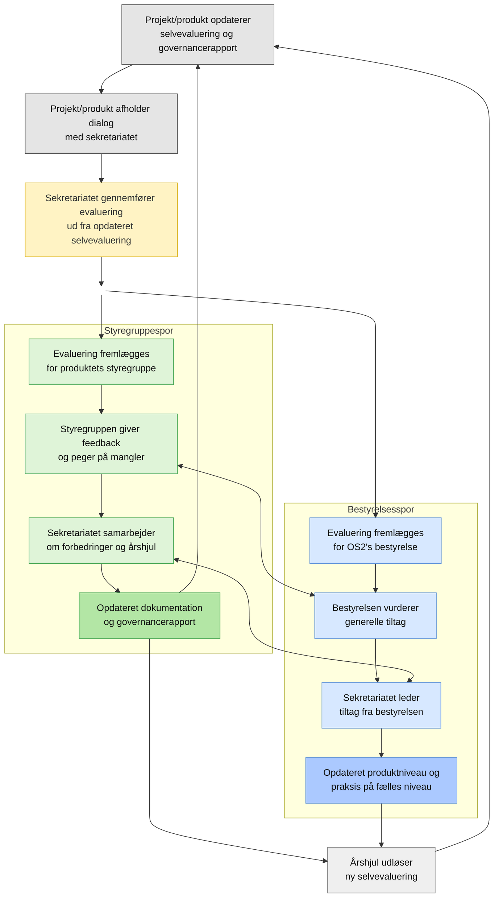

# Introduktion til evalueringsprocessen

OS2 gennemfører evalueringer af alle produkter og projekter (følgende benævnt samlet som produktet) to gange årligt som en fast del af fællesskabets porteføljestyring.

Processen tager afsæt i produktets egen selvevaluering og governancerapport, som ejes og opdateres løbende af produktorganisationen (styregruppe, projektledelse og koordinationsgruppe). På den baggrund gennemfører sekretariatet en samlet evaluering i dialog med produktorganisationen.

Evalueringen behandles i to spor. I produktets **styregruppe** med fokus på konkrete _forbedringer, dokumentation og videre udvikling_. Og i OS2’s **bestyrelse** med fokus på _tværgående prioriteringer, produktniveau og fælles praksis_.

Resultatet er både en status og et arbejdsgrundlag. Evalueringen peger på udviklingsområder i det enkelte produkt og kan samtidig føre til justeringer på tværs af porteføljen.

Processen gentages som en del af et fast årshjul, hvor opdateret selvevaluering er forudsætningen for næste evaluering. Over tid bør det opleves at arbejdet lettes i takt med, at produkter holder deres selvevaluering ajour og arbejder aktivt med OS2’s styringsmodel.

## Processen (diagram)

## Roller og ansvar i evalueringsprocessen

### Styregruppe (for produktet)

Ansvar:
- Sikre efterlevelse af OS2’s styringsmodel og krav.
- Tage strategisk stilling til produktets niveau og udvikling.

Opgaver:
- Udfylde og vedligeholde selvevalueringen.
- Fremlægge dokumentation for opfyldelse af krav.
- Indgå aktivt i dialog med sekretariatet under evalueringen.
- Forholde sig til evalueringens resultat og igangsætte nødvendige tiltag.

### Projektleder / koordinator / tovholder

Ansvar:
- Koordinere arbejdet med selvevalueringen.

Opgaver:
- Indsamle input og dokumentation fra relevante aktører.
- Udfylde selvevalueringsformularen i samarbejde med styregruppen.
- Sikre at evalueringen er opdateret og fyldestgørende.

### OS2-sekretariatet

Ansvar:
- Gennemføre evalueringen på mandat fra bestyrelsen.
- Sikre ensartet, faglig og dokumenteret vurdering på tværs af produkter.
- Stå på mål for den samlede vurdering af OS2’s portefølje.

Opgaver:
- Gennemgå selvevaluering og dokumentation.
- Foretage en samlet vurdering af kravopfyldelse.
- Udarbejde evalueringsrapport og fastlægge produktniveau.
- Indgå i dialog med styregruppen om vurderingen.
- Indhente faglig second opinion ved behov.

Bemærkning:
- Sekretariatet kan, på et dokumenteret og fagligt grundlag, nå frem til en anden vurdering end styregruppen. Den endelige vurdering fastlægges af sekretariatet.

### Bestyrelsen

Ansvar:
- Overordnet ansvar for OS2’s styringsmodel og portefølje.

Opgaver:
- Fungere som sidste instans ved uenighed.
- Træffe beslutning ved eskalerede vurderinger.
- Fastlægge strategisk retning og rammer for modellen.

### OS2-fællesskabet (øvrige deltagere)

Ansvar:
- Bidrage til transparens og kvalitet i fællesskabet.

Opgaver:
- Levere input og erfaringer til produkter.
- Anvende og bidrage til dokumentation og løsninger.
- Understøtte åbenhed og videndeling.